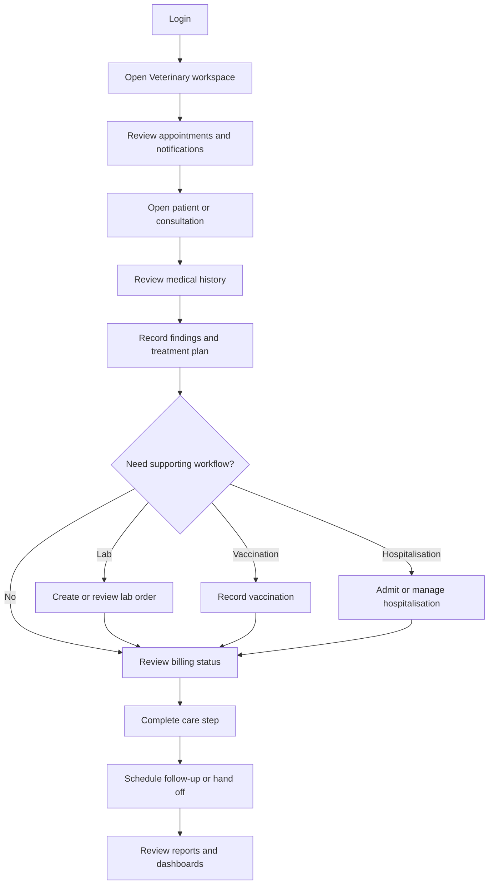

# Veterinary Doctor Operations Training Pack

## Purpose

This pack trains veterinary doctors to use the Veterinary module during daily clinic work. It covers patient review, appointments, consultations, medical history, lab requests, vaccination, hospitalisation, notifications, reports, and billing visibility where doctors can see or act on it.

## Who should use this

Use this pack if your login includes the `VetEdge Doctor` role or the starter role bundle named `Veterinary Doctor`.

## Before you start

- Confirm you can open the Veterinary workspace from the desk sidebar.
- Confirm your clinic administrator has assigned you to the correct Branch if branch restrictions are enabled.
- Use existing patient and appointment records during training. Do not create duplicate patients for practice unless your administrator provides a training site or demo data.
- If a billing or payment message appears, follow the message and involve Front Desk or Accounts when required.

## Summary process diagram

## Recommended training order

1. `doctor_daily_workflow.md`
2. `patient_medical_record_workflow.md`
3. `consultation_workflow.md`
4. `lab_order_workflow.md`
5. `vaccination_and_preventive_care_workflow.md`
6. `hospitalisation_workflow.md`
7. `notifications_and_action_centre_workflow.md`
8. `reports_and_dashboards_workflow.md`
9. `troubleshooting_and_common_errors.md`

## Documents

- `role_access_matrix.md` explains doctor-accessible roles, records, reports, dashboards, and restrictions.
- `doctor_daily_workflow.md` gives the full-day operating routine.
- `consultation_workflow.md` covers clinical capture, treatment planning, lab/vaccination actions, billing visibility, and follow-up.
- `patient_medical_record_workflow.md` covers patient lookup and history review.
- `lab_order_workflow.md` covers lab request and result review flow.
- `vaccination_and_preventive_care_workflow.md` covers vaccination and due/overdue review.
- `hospitalisation_workflow.md` covers admission, activities, stock, billing gate, and discharge.
- `notifications_and_action_centre_workflow.md` covers Veterinary notification states and responses.
- `reports_and_dashboards_workflow.md` covers doctor-accessible reports and dashboards.
- `troubleshooting_and_common_errors.md` gives quick resolution guidance.
- `screenshot_manifest.md` lists every screenshot target and capture status.

## Screenshot status summary

Screenshots are pending. No safe authenticated browser session or confirmed demo data was available during documentation generation. Each pending screenshot has exact capture instructions in `screenshot_manifest.md`.

## Known limitations

- Exact user-specific branch visibility depends on live Branch User Assignment records.
- Sales Invoice submit and payment collection depend on ERPNext permissions and Veterinary Settings. Doctors can see invoice-related information through the configured workspace and modal, but payment collection is only available when enabled.
- Pet boarding and grooming are visible in the repository but are not documented here as doctor workflows unless they intersect with clinical hospitalisation.
- Owner mobile/portal expansion is outside this doctor operations pack.

## Source files inspected

- `vetedge/services/permissions.py`
- `vetedge/services/role_bundles.py`
- `vetedge/services/report_visibility.py`
- `vetedge/workspace_sidebar/vetedge.json`
- `vetedge/veterinary/doctype/*/*.json`
- `vetedge/veterinary/page/*/*.json`
- `vetedge/veterinary/report/*/*.json`
- `vetedge/services/consultation_flow.py`
- `vetedge/services/lab.py`
- `vetedge/services/vaccination.py`
- `vetedge/services/hospitalisation.py`
- `vetedge/services/notification_api.py`
- `vetedge/services/notifications.py`
- `vetedge/services/billing_modal.py`
- `vetedge/services/payment_service.py`
