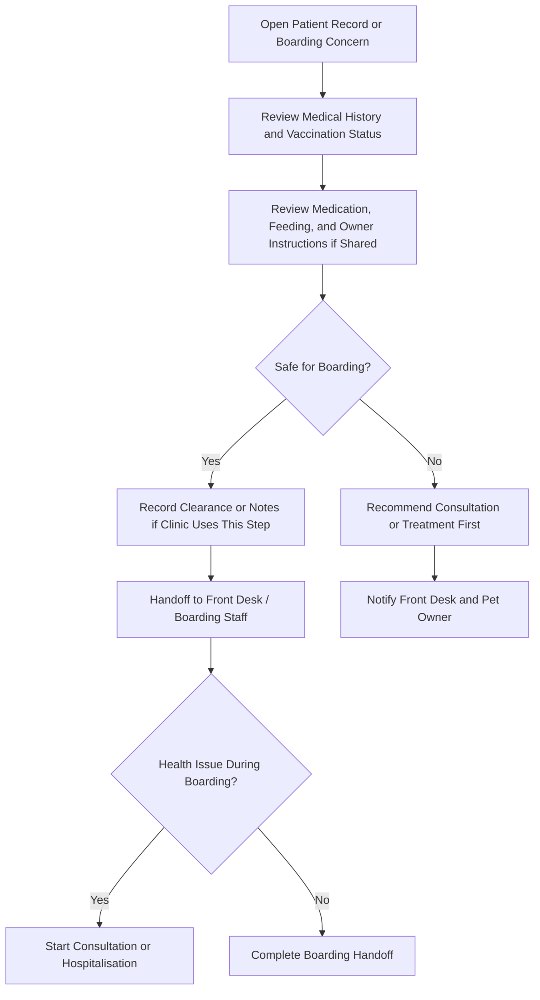

# Boarding Service Handoff Training Guide

## Module Purpose

Train veterinary doctors to support boarding safety through medical review, vaccination awareness, medication/feeding note review, and escalation when a boarding patient develops a health concern. Boarding is a non-clinical service workflow, not a core Veterinary clinical record.

## Learning Objectives

After this module, the doctor should be able to:

- Explain the difference between Boarding and Hospitalisation.
- Review patient health and vaccination status before boarding where requested.
- Identify when a patient is not fit for boarding.
- Recommend consultation or Hospitalisation when a boarding concern becomes clinical.
- Hand off booking, kennel assignment, care records, billing, and Pet Owner coordination to the right team.

## Access Boundary

Discovered Pet Boarding Booking, Pet Boarding Stay, Pet Boarding Care Record, Kennel, Boarding Dashboard, Boarding Report, and Kennel Availability Report access does not include `VetEdge Doctor` in the verified DocType/page/report role maps. Doctors should treat boarding as a medical-safety handoff workflow unless the live site grants extra roles.

If a doctor can open or edit boarding records on a live site, that access is site-specific and Needs verification from Role Permission Manager.

## Summary Process Diagram

## Step-by-Step Training Guide

1. Start from the Veterinary Patient record, a consultation, or a team request about boarding fitness.
2. Review medical history, current problems, medication needs, feeding instructions, behaviour concerns, allergies, and recent procedures.
3. Review vaccination and preventive care status if clinic policy requires current vaccination before boarding.
4. If the patient is fit for boarding, record medical clearance or notes only in the clinic-approved place.
5. If the patient is not fit for boarding, recommend consultation, treatment, or postponement before boarding.
6. If a health issue develops during boarding, decide whether it needs a consultation, urgent treatment, or Hospitalisation.
7. Do not use Boarding to replace Hospitalisation when the patient needs inpatient clinical care.
8. Billing or payment issues for boarding should go to Front Desk, Accounts, or Cashier.

## Trainer Notes

> Trainer Note: Make the difference between Boarding and Hospitalisation explicit. Boarding is accommodation/care service; Hospitalisation is inpatient clinical care.

> Trainer Note: Doctors should focus on medical clearance and escalation. Front Desk and boarding staff own booking, kennel assignment, check-in/check-out, and routine care records.

## Practical Exercise

Scenario: A boarding patient has overdue vaccination and a history of seizures.

Task:

1. Open the patient record.
2. Review vaccination and consultation history.
3. Decide whether boarding can proceed safely.
4. Write the medical recommendation.
5. Explain the handoff to Front Desk, boarding staff, and the Pet Owner.

Expected outcome: The doctor recognises medical risk, avoids treating boarding as Hospitalisation, and escalates clinical care correctly.

## When Boarding Should Become Consultation or Hospitalisation

| Situation | Doctor action |
|---|---|
| Vomiting, diarrhoea, collapse, breathing concern, seizure, injury, or severe lethargy | Start consultation or emergency review. |
| Patient needs inpatient monitoring, fluids, oxygen, repeated medication, or clinical procedures | Admit to Hospitalisation if clinically appropriate. |
| Overdue vaccination conflicts with clinic boarding policy | Advise Front Desk and Pet Owner; create vaccination workflow if clinically appropriate. |
| Medication or feeding instruction is unclear | Ask Front Desk to confirm with Pet Owner; doctor clarifies clinical instruction. |
| Boarding care record says Needs Attention | Review patient and decide whether clinical action is needed. |

## Common Mistakes

| Mistake | Better approach |
|---|---|
| Treating Boarding as Hospitalisation | Use Hospitalisation for inpatient clinical care. |
| Ignoring overdue vaccination before boarding | Follow clinic policy and advise Front Desk/Pet Owner. |
| Recording clinical treatment only in boarding notes | Use consultation or Hospitalisation records for clinical care. |
| Editing boarding billing | Hand off to Front Desk or Accounts. |
| Assuming doctors can open boarding dashboard | Verify in Role Permission Manager if access differs. |

## Troubleshooting

| Problem | Likely reason | What the doctor should do |
|---|---|---|
| Cannot access boarding record | Doctor role is not in discovered boarding permissions | Ask Front Desk/Boarding Staff for context or ask Admin to verify access. |
| Boarding patient has overdue vaccination | Preventive care may be required by clinic policy | Review vaccination history and advise Front Desk/Pet Owner. |
| Boarding patient develops health concern | Patient may need clinical care | Start consultation or Hospitalisation as appropriate. |
| Billing/payment issue blocks boarding | Boarding payment gate or invoice issue | Ask Front Desk or Accounts to resolve. |
| Kennel is not available or cannot be selected | Boarding location/capacity issue | Ask Front Desk, boarding staff, Branch Manager, or Admin. |

## Related Roles and Handoffs

| Area | Responsible role |
|---|---|
| Boarding booking, check-in, check-out, Pet Owner communication | Front Desk |
| Kennel assignment and routine boarding care records | Boarding staff or Branch Manager |
| Medical clearance, vaccination advice, emergency care | Doctor |
| Hospitalisation decision | Doctor |
| Payment or submitted invoice issue | Accounts or Cashier |
| Kennel setup and availability | Branch Manager or Admin |

## Related Screenshots

- `training_assets/screenshots/boarding-service-record.png`
- `training_assets/screenshots/boarding-health-vaccination-review.png`
- `training_assets/screenshots/boarding-medical-alert-owner-instruction.png`

See [Screenshot Manifest](training-module:screenshot-manifest) for capture instructions.

## Related Guides

- [Veterinary Doctor Training Manual](training-module:doctor-overview)
- [Patient Medical Record Workflow](training-module:patient-record)
- [Vaccination and Preventive Care Workflow](training-module:vaccination)
- [Hospitalisation Workflow](training-module:hospitalisation)
- [Troubleshooting and Common Errors](training-module:troubleshooting)
