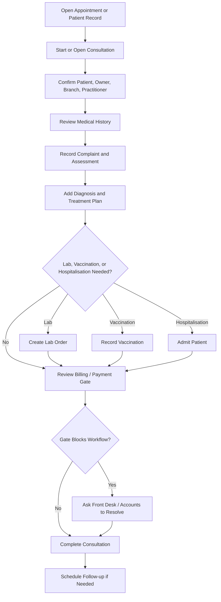

# Consultation Training Guide

## Module Purpose

Train veterinary doctors to complete a Veterinary Consultation from patient handoff through clinical documentation, treatment planning, supporting workflows, billing/payment awareness, and follow-up.

## Learning Objectives

After this module, the doctor should be able to:

- Open or start a consultation from the correct patient or appointment.
- Record complaint, history, examination, assessment, diagnosis, treatment plan, and follow-up.
- Use Veterinary Vital Signs as separate records.
- Create lab, vaccination, or Hospitalisation records when needed.
- Read payment gate messages and hand off billing issues correctly.
- Complete the consultation without bypassing accounting controls.

## Summary Process Diagram

## Step-by-Step Training Guide

1. Open the consultation from the appointment, queue, patient record, or consultation list.
2. Confirm Patient, Primary Owner, Service Branch, Consulting Practitioner User, and linked appointment.
3. Select Consultation Type when available.
4. Review Medical History and latest Veterinary Vital Signs before final decisions.
5. Record Presenting Complaint and relevant history.
6. Add symptoms where the form provides structured rows.
7. Record examination notes and assessment notes.
8. Add diagnosis using the diagnosis section where available.
9. Add planned treatments and a clear Treatment Plan Summary.
10. Add Follow Up Date if review is needed.
11. Use New Vitals when fresh vitals are needed.
12. Use New Lab Order, New Vaccination, or Admit for Hospitalisation only when clinically required.
13. Open Billing / Payment to review invoice, payment status, pending charges, or permitted payment actions.
14. If payment blocks the workflow, pause and ask Front Desk or Accounts to resolve it.
15. Complete the consultation only when documentation and next actions are clear.
16. Create a follow-up appointment where needed.

## Trainer Notes

> Trainer Note: Ask the trainee to explain what belongs in structured fields and what belongs in free-text notes. Structured diagnosis, planned treatments, vitals, lab orders, and vaccination records help downstream teams.

> Trainer Note: Submitted invoices are protected for accounting accuracy. Doctors may view status and messages, but Accounts handles invoice correction and payment settlement.

## Practice Exercise

Scenario: A cat presents with poor appetite and weight loss.

Task:

1. Open the patient and current consultation.
2. Review Medical History and latest vitals.
3. Record complaint, assessment, diagnosis, and treatment plan.
4. Create a lab order if clinically required.
5. Review Billing / Payment status.
6. Add a follow-up date.

Expected outcome: The doctor completes clinical documentation, uses supporting workflows correctly, and does not bypass payment or invoice controls.

## Consultation Status Guide

| Status | Practical meaning |
|---|---|
| Draft | Consultation exists but clinical work may not be active yet. |
| In Progress | Doctor is actively handling the consultation. |
| Awaiting Payment | Billing or payment gate needs attention. |
| Pending Dispensary | Treatment items need dispensary fulfilment. |
| Ready for Treatment | Payment or dispensary requirements allow treatment to proceed. |
| Completed | Consultation is finished. |
| Cancelled | Consultation was cancelled. |

## Payment Gate Guidance

| Message type | What it means | Doctor action |
|---|---|---|
| Full Payment Required | Workflow may be blocked until full payment is made. | Ask Front Desk or Accounts to resolve. |
| Partial Payment Gate | A partial payment rule may apply. | Read the message and involve Accounts if blocked. |
| No Payment Gate | Payment does not block the step. | Continue care while keeping billing accurate. |

## Common Mistakes

| Mistake | Better approach |
|---|---|
| Creating a lab order before saving consultation changes | Save first, then create the lab order. |
| Completing despite a blocking payment gate | Resolve through Front Desk or Accounts first. |
| Recording treatment only as free text | Use planned treatment rows where available. |
| Recording vitals only in notes | Use Veterinary Vital Signs. |

## Troubleshooting

| Problem | What the doctor should do |
|---|---|
| New Lab Order button asks you to save | Save the consultation and try again. |
| Billing / Payment button is missing | Save the record and ask Admin to verify settings or access. |
| Invoice already submitted | Ask Accounts to handle correction or replacement. |
| Hospitalisation action is unavailable | Ask Admin to verify settings and role access. |

## Related Roles and Handoffs

| Handoff | Responsible role |
|---|---|
| Appointment readiness and follow-up booking | Front Desk |
| Payment gate and invoice settlement | Front Desk, Accounts, or Cashier |
| Lab sample and result entry | Lab Technician |
| Medication fulfilment | Pharmacy or Dispensary |
| Vitals and treatment support | Nurse |

## Related Screenshots

- `training_assets/screenshots/consultation-assessment-section.png`
- `training_assets/screenshots/consultation-treatment-plan.png`
- `training_assets/screenshots/billing-payment-modal.png`
- `training_assets/screenshots/lab-order-dialog.png`

See [Screenshot Manifest](training-module:screenshot-manifest) for capture instructions.

## Related Guides

- [Medical History Completion and Clinical Truth](training-module:shared-medical-history)
- [Safe Workflow Handoffs](training-module:shared-safe-handoffs)
- [Veterinary Doctor Training Manual](training-module:doctor-overview)
- [Lab Order Workflow](training-module:lab-order)
- [Vaccination and Preventive Care Workflow](training-module:vaccination)
- [Hospitalisation Workflow](training-module:hospitalisation)
