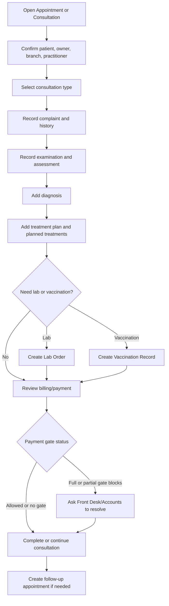

# Consultation Workflow

## Purpose

Use this guide to run a consultation from appointment handoff through clinical capture, lab/vaccination requests, treatment planning, billing status review, completion, and follow-up.

## Who should use this

Veterinary doctors handling outpatient or clinical consultations.

## Before you start

- Confirm the patient and owner.
- Confirm the appointment is ready for consultation when starting from an appointment.
- Save the consultation before creating lab orders or relying on linked follow-up details.
- Check payment gate messages before completing care when billing enforcement is active.

## Summary process diagram

## Step-by-step guide

1. Open the consultation from `Consultations`, the appointment, the appointment queue, or the patient record.
2. Confirm `Patient`, `Primary Owner`, `Service Branch`, `Consulting Practitioner User`, and linked appointment.
3. Select `Consultation Type` when available.
4. Record `Presenting Complaint`.
5. Add symptoms in the Symptoms table where appropriate.
6. Record examination notes and assessment notes.
7. Add diagnoses in the Diagnoses table. Diagnosis and treatment capture are doctor-controlled actions.
8. Add planned treatments in `Planned Treatments`.
9. Write a clear `Treatment Plan Summary`.
10. Add `Follow Up Date` if review is needed.
11. Use `New Vitals` to record fresh vitals as a separate record.
12. Use `Latest Vitals` to review recent vitals.
13. Use `View Medical History` before final decisions if prior context is needed.
14. Use `New Lab Order` when diagnostic testing is required.
15. Use `New Vaccination` when vaccination is clinically appropriate and the vaccination feature is enabled.
16. Use `Admit for Hospitalisation` when inpatient care is required and hospitalisation is enabled.
17. Use `Billing / Payment` to review invoice, payment status, pending charges, or permitted payment actions.
18. Move the consultation status according to the clinic workflow.
19. Use `Create Follow-up Appointment` when follow-up is needed.

## Consultation status guide

| Status | Meaning |
|---|---|
| Draft | Consultation exists but clinical work is not underway or not saved as active. |
| In Progress | Doctor is actively handling the consultation. |
| Awaiting Payment | Billing/payment gate needs attention. |
| Pending Dispensary | Treatment items need dispensary fulfillment. |
| Ready for Treatment | Payment/dispensary requirements allow treatment to proceed. |
| Completed | Consultation is finished. |
| Cancelled | Consultation was cancelled. |

## Payment gate meaning

| Gate | What it means for the doctor | Action |
|---|---|---|
| Full Payment Required | Care or completion may be blocked until the invoice is fully paid. | Ask Front Desk/Accounts to collect or resolve payment. |
| Partial Payment Gate | The system may allow progress after partial payment or configured threshold. | Read the payment gate message and involve Accounts if blocked. |
| No Payment Gate | Payment does not block consultation progress. | Continue care, but still keep billing accurate. |

## Important notes

- Doctors must not manually mark invoices paid.
- If the linked invoice is already submitted, the billing modal may show that it cannot be changed directly. Accounts may need to handle corrections or cancellation/replacement.
- If consultation billing is disabled in settings, billing actions may not appear.
- If hospitalisation is disabled in settings, `Admit for Hospitalisation` may not appear.

## Common mistakes

| Mistake | What to do instead |
|---|---|
| Creating a lab order before saving changes | Save the consultation first. |
| Completing despite a blocking payment gate | Resolve with Front Desk/Accounts first. |
| Using free text only for diagnosis | Use the diagnosis table where possible. |
| Recording treatment without item context | Use planned treatment rows for clear dispensary handoff. |

## What happens next

- Lab orders move to lab staff for sample/result work.
- Vaccination records may create billing and stock references.
- Planned treatments may move to dispensary.
- Follow-up appointments appear in appointments.
- Billing remains tied to Sales Invoice and Payment Entry.

## Related records

- Veterinary Appointment
- Veterinary Patient
- Veterinary Consultation
- Veterinary Vital Signs
- Veterinary Lab Order
- Veterinary Vaccination Record
- Veterinary Hospitalisation
- Sales Invoice

## Troubleshooting

See `troubleshooting_and_common_errors.md` for dirty-save warnings, payment gates, invoice errors, and permission denied messages.

## Screenshots / visual references

Pending screenshots:

- `consultation-assessment-section.png`
- `consultation-treatment-plan.png`
- `billing-payment-modal.png`
- `lab-order-dialog.png`

## Source files inspected

- `vetedge/veterinary/doctype/veterinary_consultation/veterinary_consultation.json`
- `vetedge/veterinary/doctype/veterinary_consultation/veterinary_consultation.js`
- `vetedge/services/consultation_flow.py`
- `vetedge/services/billing_modal.py`
- `vetedge/veterinary/doctype/veterinary_settings/veterinary_settings.json`
