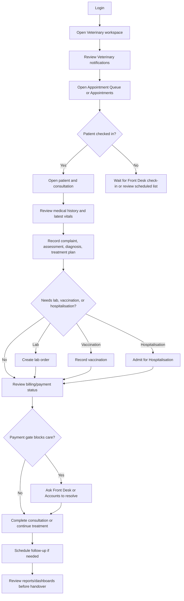

# Doctor Daily Workflow

## Purpose

Use this guide as the doctor’s daily operating checklist, from login through appointments, consultations, hospitalisation review, notifications, and end-of-day reports.

## Who should use this

Veterinary doctors with the `VetEdge Doctor` role or the `Veterinary Doctor` role bundle.

## Before you start

- Confirm you are signed into the correct clinic site.
- Confirm your Branch is correct if the clinic uses branch assignment.
- Use the Veterinary workspace/sidebar for the fastest entry points.
- Do not create a new patient until you have searched for the patient first.

## Summary process diagram

## Step-by-step guide

1. Login and open the Veterinary workspace.
2. Check Veterinary notifications first. Look for urgent lab results, pending treatment reviews, payment gate alerts, missed appointment alerts, and vaccination due/overdue reminders.
3. Open `Appointment Queue` or `Appointments`.
4. Review today’s appointments by Branch, practitioner, appointment type, and status.
5. For a checked-in patient, open the linked patient and consultation.
6. Review the patient record before entering new findings. Confirm owner, species, breed, default branch, alerts, and prior history.
7. Open `Medical History` when you need timeline context across consultations, vitals, vaccinations, labs, and hospitalisation.
8. Record the consultation findings: presenting complaint, symptoms, examination notes, assessment notes, diagnosis, planned treatments, treatment summary, and follow-up date.
9. Use `New Vitals` when fresh vitals are needed. Vitals are separate records.
10. Use `New Lab Order` if diagnostic testing is required.
11. Use `New Vaccination` if vaccination is clinically appropriate and enabled.
12. Use `Admit for Hospitalisation` if the patient needs inpatient care and hospitalisation is enabled.
13. Open `Billing / Payment` only to review billing status or perform allowed actions. If payment collection is not enabled for doctors, ask Front Desk or Accounts to resolve payment.
14. Complete the consultation only when clinical notes and required next actions are clear.
15. Create a follow-up appointment when the consultation requires review.
16. Before handover or end of day, review Clinical Dashboard, Lab Dashboard, Vaccination Dashboard, Hospitalisation Dashboard, and Practitioner Performance Dashboard where relevant.

## Important notes

- Branch validation is server-side. A record may be hidden or blocked if it belongs to another branch.
- Payment gates can pause treatment or completion depending on Veterinary Settings.
- Doctors should not manually mark invoices paid. Payments must use ERPNext accounting flows.
- If the consultation has unsaved changes, save before creating lab orders or relying on follow-up appointment details.

## Common mistakes

| Mistake | Better approach |
|---|---|
| Creating a new patient without searching | Search patient name, owner, and microchip first. |
| Recording vitals only in consultation notes | Use `New Vitals` so trends and history work. |
| Ignoring payment gate messages | Ask Front Desk or Accounts to resolve the invoice/payment issue. |
| Adding treatment without diagnosis or plan | Record diagnosis and treatment plan clearly before handoff. |
| Discharging before stock/billing readiness | Use `Check Discharge Readiness` first. |

## What happens next

- Front Desk may schedule or confirm follow-up.
- Lab staff may collect samples and enter results.
- Dispensary may issue stock for planned treatments.
- Accounts may submit invoices and record payments.
- Nurses may continue hospitalisation activities.

## Related records

- Veterinary Patient
- Veterinary Appointment
- Veterinary Consultation
- Veterinary Vital Signs
- Veterinary Lab Order
- Veterinary Vaccination Record
- Veterinary Hospitalisation
- Sales Invoice
- Veterinary Notification Item

## Troubleshooting

See `troubleshooting_and_common_errors.md` for permission, payment, stock, discharge, and feature-disabled messages.

## Screenshots / visual references

Pending screenshots:

- `doctor-dashboard-overview.png`
- `appointment-queue-overview.png`
- `veterinary-notification-badge.png`
- `doctor-reports-list.png`

Refer to `screenshot_manifest.md` for capture instructions.

## Source files inspected

- `vetedge/workspace_sidebar/vetedge.json`
- `vetedge/services/report_visibility.py`
- `vetedge/veterinary/doctype/veterinary_appointment/veterinary_appointment.json`
- `vetedge/veterinary/doctype/veterinary_consultation/veterinary_consultation.js`
- `vetedge/services/notification_api.py`
