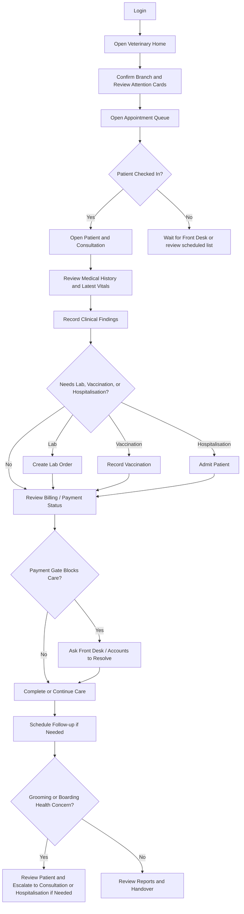

# Doctor Daily Workflow Training Guide

## Module Purpose

Train veterinary doctors to use VetEdge for a normal clinic day: login, queue review, patient review, consultations, handoffs, notifications, and end-of-day review.

## Learning Objectives

After this module, the doctor should be able to:

- Open Veterinary Home and review role-aware daily work.
- Use the Appointment Queue safely.
- Review patient history before treatment.
- Move from consultation to lab, vaccination, Hospitalisation, or follow-up.
- Recognise grooming or boarding health concerns that need doctor review.
- Recognise billing/payment gate messages and hand off correctly.
- Use dashboards and notifications during the day.

## Summary Process Diagram

## Step-by-Step Training Guide

1. Sign in and open Veterinary Home at `/desk/vetedge`.
2. Confirm the current company, branch and practitioner context; review attention cards and Veterinary notifications for urgent lab results, treatment reviews, payment gate alerts, missed appointments, vaccination reminders, and Hospitalisation actions.
3. Open Appointment Queue or Appointments.
4. Review today's patients by Branch, practitioner, appointment type, and status.
5. For a checked-in patient, open the existing patient record and consultation.
6. Confirm patient identity and owner before documenting care.
7. Review Medical History and latest Veterinary Vital Signs.
8. Record complaint, examination, assessment, diagnosis, treatment plan, planned treatments, and follow-up.
9. Create lab orders, vaccination records, or Hospitalisation records only when clinically required.
10. Use Billing / Payment only to understand payment or invoice status. Do not manually change submitted invoices.
11. If a payment gate blocks care, ask Front Desk or Accounts to resolve it.
12. If grooming staff reports wounds, parasites, skin infection, pain, or handling risk, review the patient and recommend consultation if needed.
13. If boarding staff reports overdue vaccination, unclear medication/feeding instructions, illness, injury, or abnormal behaviour, review the patient and escalate to consultation or Hospitalisation if needed.
14. Complete the consultation or hand off to the correct team.
15. Before handover or end of day, refresh Veterinary Home, reconcile the remaining cards to source rows and review relevant dashboards.

## Trainer Notes

> Trainer Note: Ask the trainee to narrate the handoff at each point. For example, "This is now for Lab Technician", "This is now for Accounts", or "This remains my clinical responsibility."

> Trainer Note: Reinforce that Front Desk handles registration and appointment coordination. Doctors should not create duplicate patients just to continue quickly.

## Practice Exercise

Scenario: A doctor begins a morning shift with three scheduled appointments, one lab result alert, and one Hospitalisation patient.

Task:

1. Open the Veterinary workspace.
2. Check notifications.
3. Open the Appointment Queue.
4. Open one checked-in patient.
5. Review history and start the consultation.
6. Explain what happens if a payment gate appears.
7. Open the Hospitalisation dashboard and identify pending clinical work.

Expected outcome: The doctor can organise the day without bypassing branch, billing, or handoff controls.

## Common Mistakes

| Mistake | Better approach |
|---|---|
| Creating a new patient without searching | Search patient name, owner, and microchip first. |
| Recording vitals only in consultation notes | Use Veterinary Vital Signs so trends work. |
| Ignoring payment gate messages | Ask Front Desk or Accounts to resolve the invoice/payment issue. |
| Adding treatment without diagnosis or plan | Record diagnosis and treatment plan clearly before handoff. |
| Discharging before readiness checks | Use Check Discharge Readiness first. |

## Troubleshooting

| Problem | What the doctor should do |
|---|---|
| Patient is not checked in | Ask Front Desk to update the appointment status. |
| Patient record does not open | Confirm patient, Branch, and role access with Admin or Branch Manager. |
| Billing / Payment message blocks progress | Contact Front Desk or Accounts. |
| Dashboard shows no data | Check filters, Branch access, and date range. |
| Grooming health concern is reported | Review the patient record and recommend consultation if clinical assessment is needed. |
| Boarding health concern is reported | Review patient history and decide whether consultation or Hospitalisation is needed. |

## Related Roles and Handoffs

| Handoff | Responsible role |
|---|---|
| Check-in, registration, appointment coordination | Front Desk |
| Payment collection, submitted invoice correction | Accounts or Cashier |
| Sample collection and result entry | Lab Technician |
| Medication dispensing and stock issue | Pharmacy or Dispensary |
| Vitals and inpatient care support | Nurse |
| Grooming scheduling and service completion | Front Desk or Grooming Staff |
| Boarding booking, kennel assignment, and routine boarding care | Front Desk or boarding staff |

## Related Screenshots

- `training_assets/screenshots/doctor-dashboard-overview.png`
- `training_assets/screenshots/appointment-queue-overview.png`
- `training_assets/screenshots/veterinary-notification-badge.png`
- `training_assets/screenshots/doctor-reports-list.png`

See [Screenshot Manifest](training-module:screenshot-manifest) for capture instructions.

## Related Guides

- [Veterinary Home and EdgeSuite Daily Start](training-module:shared-veterinary-home)
- [Medical History Completion and Clinical Truth](training-module:shared-medical-history)
- [Safe Workflow Handoffs](training-module:shared-safe-handoffs)
- [Veterinary Doctor Training Manual](training-module:doctor-overview)
- [Patient Medical Record Workflow](training-module:patient-record)
- [Consultation Workflow](training-module:consultation)
- [Grooming Service Handoff Workflow](training-module:grooming-handoff)
- [Boarding Service Handoff Workflow](training-module:boarding-handoff)
- [Troubleshooting and Common Errors](training-module:troubleshooting)
