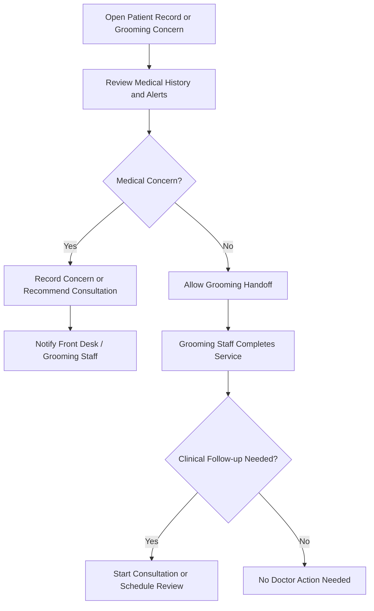

# Grooming Service Handoff Training Guide

## Module Purpose

Train veterinary doctors to understand grooming-related handoffs when medical review is needed. Grooming is a non-clinical service workflow, not a core Veterinary clinical record.

## Learning Objectives

After this module, the doctor should be able to:

- Explain when grooming is a service handoff rather than a consultation.
- Review the patient record before giving medical advice about grooming.
- Identify medical concerns that make grooming unsafe.
- Recommend consultation or treatment when grooming reveals a health issue.
- Hand off scheduling, service completion, grooming billing, and owner coordination to the right team.

## Access Boundary

Discovered Pet Grooming Appointment, Pet Grooming Session, Pet Grooming Service, Grooming Dashboard, and Grooming Report access does not include `VetEdge Doctor` in the verified DocType/page/report role maps. Doctors should treat grooming as a handoff workflow unless the live site grants extra roles.

If a doctor can open or edit grooming records on a live site, that access is site-specific and Needs verification from Role Permission Manager.

## Summary Process Diagram

## Step-by-Step Training Guide

1. Start from the Veterinary Patient record, a consultation, or a team request about grooming safety.
2. Review medical history, recent consultations, allergies, skin concerns, wounds, parasites, infection, pain, anxiety, or handling risks.
3. Review vaccination/preventive care status if clinic policy requires it before grooming.
4. If no medical concern is found, tell Front Desk or Grooming Staff that the patient can proceed through the grooming workflow.
5. If a medical concern is found, record the concern in the appropriate clinical record or recommend a consultation.
6. If grooming is unsafe, advise Front Desk/Grooming Staff to pause the service and communicate the medical concern to the Pet Owner.
7. If a groomer notices wounds, parasites, infection, injury, pain, or abnormal behaviour, the doctor should review and decide whether to start a consultation.
8. Billing or payment issues for grooming should go to Front Desk, Accounts, or Cashier.

## Trainer Notes

> Trainer Note: Make the boundary clear. Grooming staff complete grooming records; doctors give clinical advice when grooming may affect patient safety.

> Trainer Note: A grooming concern should become a consultation only when clinical assessment or treatment is needed. Do not document grooming service completion as a consultation.

## Practical Exercise

Scenario: A groomer reports that a dog scheduled for grooming has an open skin wound.

Task:

1. Open the patient record.
2. Review recent consultation and vaccination history.
3. Decide whether grooming should proceed.
4. Record or recommend the correct clinical follow-up.
5. Explain the handoff to Front Desk and Grooming Staff.

Expected outcome: The doctor protects patient safety without taking over the grooming service workflow.

## Common Medical Concerns Before Grooming

| Concern | Doctor action |
|---|---|
| Open wound, infection, swelling, or painful skin | Recommend consultation before grooming. |
| Heavy parasite burden | Recommend clinical review and treatment plan. |
| Severe anxiety, aggression, or handling risk | Advise on safety and whether consultation is needed. |
| Recent surgery or sutures | Confirm whether grooming should be delayed. |
| Overdue vaccination where clinic policy requires current vaccination | Ask Front Desk to coordinate with Pet Owner; create/recommend vaccination workflow if clinically appropriate. |

## Common Mistakes

| Mistake | Better approach |
|---|---|
| Treating grooming as a clinical record | Keep grooming as a non-clinical service handoff. |
| Ignoring a groomer-reported wound | Review the patient and recommend consultation if needed. |
| Editing grooming billing | Hand off to Front Desk or Accounts. |
| Assuming doctors can access grooming dashboard | Verify in Role Permission Manager if access differs. |

## Troubleshooting

| Problem | Likely reason | What the doctor should do |
|---|---|---|
| Cannot access grooming record | Doctor role is not in discovered grooming permissions | Ask Front Desk/Grooming Staff for context or ask Admin to verify access. |
| Grooming request has medical concern | Patient may need clinical review before service | Open patient record and recommend consultation if needed. |
| Grooming billing/payment issue appears | Grooming billing is a service/admin/accounts workflow | Ask Front Desk or Accounts to resolve. |
| Grooming service value is missing | Service master may not be configured | Ask Front Desk, Groomer, Branch Manager, or Admin. |

## Related Roles and Handoffs

| Area | Responsible role |
|---|---|
| Grooming appointment and owner coordination | Front Desk |
| Grooming service and session completion | Groomer or grooming staff |
| Medical concern review | Doctor |
| Payment or submitted invoice issue | Accounts or Cashier |
| Grooming service master setup | Groomer, Branch Manager, or Admin |

## Related Screenshots

- `training_assets/screenshots/grooming-service-record.png`
- `training_assets/screenshots/grooming-health-note-handoff.png`

See [Screenshot Manifest](training-module:screenshot-manifest) for capture instructions.

## Related Guides

- [Veterinary Doctor Training Manual](training-module:doctor-overview)
- [Patient Medical Record Workflow](training-module:patient-record)
- [Vaccination and Preventive Care Workflow](training-module:vaccination)
- [Troubleshooting and Common Errors](training-module:troubleshooting)
