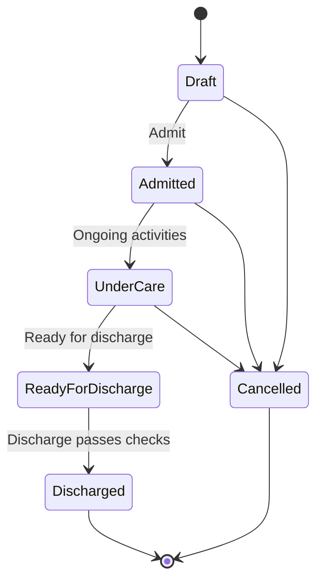

# Hospitalisation Workflow

## Purpose

Use this guide to admit a patient, record hospitalisation activities, manage billing/stock handoffs, check discharge readiness, and discharge safely.

## Who should use this

Veterinary doctors managing inpatient clinical care.

## Before you start

- Confirm hospitalisation is enabled in Veterinary Settings.
- Confirm patient, owner, service branch, attending veterinarian, and admission reason.
- Confirm care location if location tracking is used.
- Review payment gate and discharge readiness before final discharge.

## Summary process diagram

## Step-by-step guide

1. From a consultation, click `Admit for Hospitalisation`, or create/open `Hospitalisations`.
2. Confirm patient, owner, service branch, company, linked consultation, attending veterinarian, admitted by, admission reason, and care level.
3. Assign a care location if location tracking is used. Available actions include viewing available locations, assigning location, and releasing location.
4. Click `Admit` if the record is still in Draft.
5. During care, use the Clinical buttons to add activity rows:
   - Vitals
   - Medication
   - Vaccination
   - Fluid Therapy
   - Feeding
   - Nursing Note
   - Wound Care
   - Lab
   - Procedure
   - Oxygen / Nebulisation
   - Owner Update
   - Other Activity
6. Mark billable activities when they should be added to the charge sheet.
7. Mark stock-affecting activities when stock should be posted.
8. Use `Build Charge Sheet` to prepare charges.
9. Use `Generate Daily Charges` for configured inpatient daily charges.
10. Use `Sync Charges to Invoice` to connect charge items to Sales Invoice.
11. Use `Post Stock Usage` to preview and post stock-affecting activities.
12. Open `Billing / Payment` to review invoice/payment state.
13. Click `Check Payment Gate` when payment status needs to be refreshed.
14. Before discharge, click `Check Discharge Readiness`.
15. If readiness is blocked, resolve pending stock, billing, or charge issues first.
16. Click `Discharge`, enter condition at discharge, discharge summary, instructions, and follow-up notes.

## Hospitalisation statuses

| Status | Meaning |
|---|---|
| Draft | Admission record exists but patient is not admitted yet. |
| Admitted | Patient is admitted. |
| Under Care | Patient is actively receiving inpatient care. |
| Ready for Discharge | Patient is clinically ready, pending operational checks. |
| Discharged | Hospitalisation is complete. |
| Cancelled | Admission was cancelled. |

## Activity and billing behavior

| Activity setting | Meaning |
|---|---|
| Billable | Activity should become a pending charge. |
| Billing Status: Pending Charge | Activity needs charge-sheet/invoice sync. |
| Stock Affecting | Activity may consume stock. |
| Stock Status: Pending | Stock posting is required. |
| Stock Status: Posted | Stock has been posted through Stock Entry. |

## Payment gate behavior

| Gate | Meaning |
|---|---|
| Full Payment Required | Hospitalisation may be blocked until full payment. |
| Partial Payment Gate | Partial payment or configured rule may allow progress. |
| No Payment Gate | Payment does not block care, but billing still matters. |

## Important notes

- Discharge can be blocked by pending stock activities, billing, invoice, unpaid/partly paid state, or other readiness checks.
- Stock shortage or missing warehouse must be resolved before stock posting can complete.
- Doctors should not bypass Sales Invoice or Payment Entry.
- Owner updates should be recorded as activity rows when clinically relevant.

## Common mistakes

| Mistake | Better approach |
|---|---|
| Recording medication without stock context | Mark stock-affecting when stock should be consumed. |
| Discharging before posting stock | Run discharge readiness and post stock usage. |
| Forgetting daily charges | Generate daily charges before final billing. |
| Ignoring care location release | Release location when patient leaves if location tracking is used. |

## What happens next

- Accounts resolves invoice/payment items.
- Pharmacy/stock resolves stock posting issues.
- Front Desk schedules follow-up if required.
- Nursing team continues activities until discharge.

## Related records

- Veterinary Hospitalisation
- Veterinary Hospitalisation Activity
- Veterinary Hospitalisation Charge Item
- Veterinary Care Location
- Veterinary Consultation
- Veterinary Vital Signs
- Veterinary Lab Order
- Veterinary Vaccination Record
- Sales Invoice
- Stock Entry

## Troubleshooting

See `troubleshooting_and_common_errors.md` for missing warehouse, stock shortage, discharge blocking, and payment gate issues.

## Screenshots / visual references

Pending screenshots:

- `hospitalisation-record-opened.png`
- `hospitalisation-activity-log.png`
- `discharge-readiness-checklist.png`

## Source files inspected

- `vetedge/services/hospitalisation.py`
- `vetedge/veterinary/doctype/veterinary_hospitalisation/veterinary_hospitalisation.json`
- `vetedge/veterinary/doctype/veterinary_hospitalisation/veterinary_hospitalisation.js`
- `vetedge/veterinary/doctype/veterinary_hospitalisation_activity/veterinary_hospitalisation_activity.json`
- `vetedge/veterinary/page/veterinary_hospitalisation_dashboard/veterinary_hospitalisation_dashboard.json`
