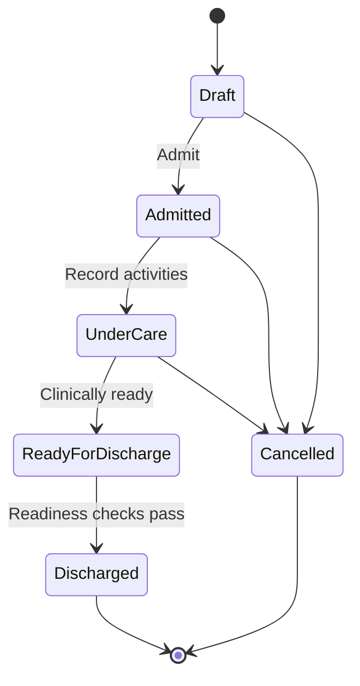

# Hospitalisation Training Guide

## Module Purpose

Train veterinary doctors to admit a patient for Hospitalisation, record inpatient care, coordinate billing and stock handoffs, check discharge readiness, and discharge safely.

## Learning Objectives

After this module, the doctor should be able to:

- Create or open a Veterinary Hospitalisation record.
- Confirm admission details and care location.
- Record inpatient clinical activities.
- Mark billable and stock-affecting activities correctly.
- Understand daily charges, charge sheets, stock posting, and payment gate messages at a practical level.
- Run discharge readiness and resolve handoffs before discharge.

## Summary Process Diagram

## Step-by-Step Training Guide

1. From a consultation, click Admit for Hospitalisation, or create/open Hospitalisations.
2. Confirm patient, owner, service Branch, company, linked consultation, attending veterinarian, admitted by, admission reason, and care level.
3. Assign a care location if location tracking is used.
4. Admit the patient.
5. During care, add activity rows for vitals, medication, vaccination, fluid therapy, feeding, nursing notes, wound care, lab, procedure, oxygen/nebulisation, owner update, or other activities.
6. Mark activities as billable when they should be charged.
7. Mark activities as stock-affecting when stock should be consumed.
8. Build the charge sheet where required.
9. Generate daily charges where configured.
10. Sync charges to Sales Invoice through the supported workflow.
11. Post stock usage only through the supported stock process.
12. Review Billing / Payment status.
13. Run Check Payment Gate when payment status needs refresh.
14. Before discharge, run Check Discharge Readiness.
15. Resolve blocked items with Accounts, Pharmacy, Dispensary, stock team, Nurse, or Admin as appropriate.
16. Discharge only after readiness checks pass and discharge notes are complete.

## Trainer Notes

> Trainer Note: Hospitalisation is a team workflow. Doctors own clinical decisions and discharge instructions; nurses support ongoing care; Accounts handles invoice/payment issues; Pharmacy or Dispensary handles stock issues.

> Trainer Note: A discharge block is not a nuisance message. It protects patient care, billing accuracy, and stock accuracy.

## Practice Exercise

Scenario: A dehydrated dog needs inpatient fluids and monitoring.

Task:

1. Admit the patient for Hospitalisation.
2. Assign a care location if used.
3. Add vitals and fluid therapy activities.
4. Mark the correct billing and stock options.
5. Explain how daily charges are generated.
6. Run through the discharge readiness checklist.

Expected outcome: The doctor can manage inpatient workflow and explain each required handoff before discharge.

## Hospitalisation Status Guide

| Status | Practical meaning |
|---|---|
| Draft | Admission record exists but patient is not admitted. |
| Admitted | Patient is admitted. |
| Under Care | Patient is actively receiving inpatient care. |
| Ready for Discharge | Patient is clinically ready, pending checks. |
| Discharged | Hospitalisation is complete. |
| Cancelled | Admission was cancelled. |

## Common Mistakes

| Mistake | Better approach |
|---|---|
| Recording medication without stock context | Mark stock-affecting when stock should be consumed. |
| Discharging before posting required stock | Run discharge readiness and resolve stock items. |
| Forgetting daily charges | Generate daily charges before final billing where configured. |
| Ignoring care location release | Release location when patient leaves if location tracking is used. |
| Manually adjusting submitted invoices | Ask Accounts to handle invoice corrections. |

## Troubleshooting

| Problem | What the doctor should do |
|---|---|
| Cannot admit patient | Check required fields, settings, role, and Branch access. |
| Stock shortage appears | Ask Pharmacy, Dispensary, or stock team to resolve. |
| Missing warehouse appears | Ask Admin or stock team to configure the Branch warehouse. |
| Discharge is blocked | Read readiness details and resolve stock, billing, payment, or missing discharge notes. |
| Payment gate blocks discharge | Ask Front Desk or Accounts to resolve payment. |

## Related Roles and Handoffs

| Handoff | Responsible role |
|---|---|
| Clinical admission and discharge decision | Doctor |
| Ongoing vitals, medication support, nursing notes | Nurse |
| Stock issue, batch, warehouse, and stock posting support | Pharmacy, Dispensary, or stock team |
| Invoice, payment, submitted invoice correction | Accounts or Cashier |
| Follow-up appointment | Front Desk |

## Related Screenshots

- `training_assets/screenshots/hospitalisation-record-opened.png`
- `training_assets/screenshots/hospitalisation-activity-log.png`
- `training_assets/screenshots/discharge-readiness-checklist.png`

See [Screenshot Manifest](screenshot_manifest.md) for capture instructions.

## Related Guides

- [Veterinary Doctor Training Manual](veterinary_doctor_training_manual.md)
- [Consultation Workflow](consultation_workflow.md)
- [Troubleshooting and Common Errors](troubleshooting_and_common_errors.md)
