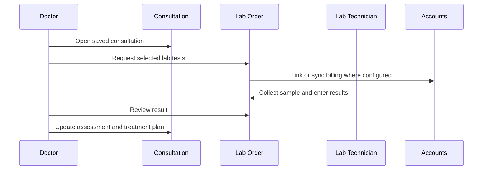

# Lab Order Training Guide

## Module Purpose

Train veterinary doctors to request lab tests from a consultation, follow lab order status, review results, and update the care plan.

## Learning Objectives

After this module, the doctor should be able to:

- Create a lab order from a saved consultation.
- Select clinically necessary lab tests.
- Understand the Lab Technician handoff.
- Review entered results.
- Update assessment, diagnosis, treatment plan, follow-up, or Hospitalisation decisions after results.
- Avoid editing reviewed results incorrectly.

## Summary Process Diagram

## Step-by-Step Training Guide

1. Open the saved Veterinary Consultation.
2. Click New Lab Order.
3. Select one or more clinically necessary active lab tests.
4. Add sample notes if useful.
5. Submit the lab order request.
6. Use View Lab Orders from the consultation to review linked orders.
7. Open the lab order and check status, requested date, requested by, service Branch, tests, and linked invoice if visible.
8. Allow Lab Technician or lab staff to collect samples, process tests, and enter results.
9. Review the lab order after results are entered.
10. Return to the consultation and update assessment, diagnosis, treatment plan, follow-up, or Hospitalisation plan if results change care.

## Trainer Notes

> Trainer Note: Make the handoff clear. The doctor requests and reviews; the Lab Technician usually processes samples and enters results.

> Trainer Note: Reviewed lab results should not be edited casually. If a result is wrong, follow the clinic correction process.

## Practice Exercise

Scenario: A dog with vomiting and dehydration needs diagnostic testing.

Task:

1. Open a saved consultation.
2. Create a lab order.
3. Select the required tests.
4. Open the lab order summary.
5. Explain what the doctor does after results are entered.

Expected outcome: The doctor can request lab work and complete the result-review handoff.

## Lab Order Status Guide

| Status | Meaning |
|---|---|
| Draft | Order exists but is not requested. |
| Requested | Doctor has requested tests. |
| Sample Collected | Sample has been collected. |
| In Progress | Lab work is underway. |
| Result Entered | Results have been entered and need review. |
| Reviewed | Doctor review is complete. |
| Cancelled | Lab order is cancelled. |

## Common Mistakes

| Mistake | Better approach |
|---|---|
| Creating lab order before saving consultation | Save consultation first. |
| Selecting duplicate or unnecessary tests | Select only clinically necessary tests. |
| Editing reviewed results | Follow correction process through Lab/Admin. |
| Ignoring invoice status | Ask Accounts if billing is blocked. |

## Troubleshooting

| Problem | Likely reason | What the doctor should do |
|---|---|---|
| Select at least one lab test | No test was selected | Select at least one active lab test. |
| Cannot create lab order | Unsaved consultation, missing role, branch issue, or disabled access | Save and ask Admin to verify access if needed. |
| Result cannot be edited | Status is Reviewed | Follow correction process. |
| Invoice already submitted | ERPNext submitted invoice is locked | Ask Accounts to handle correction or replacement. |

## Related Roles and Handoffs

| Handoff | Responsible role |
|---|---|
| Test request and result review | Doctor |
| Sample collection, test processing, result entry | Lab Technician |
| Invoice/payment issues | Accounts or Cashier |
| Treatment update after result | Doctor |

## Related Screenshots

- `training_assets/screenshots/lab-order-dialog.png`
- `training_assets/screenshots/lab-order-summary.png`

See [Screenshot Manifest](screenshot_manifest.md) for capture instructions.

## Related Guides

- [Veterinary Doctor Training Manual](veterinary_doctor_training_manual.md)
- [Consultation Workflow](consultation_workflow.md)
- [Troubleshooting and Common Errors](troubleshooting_and_common_errors.md)
