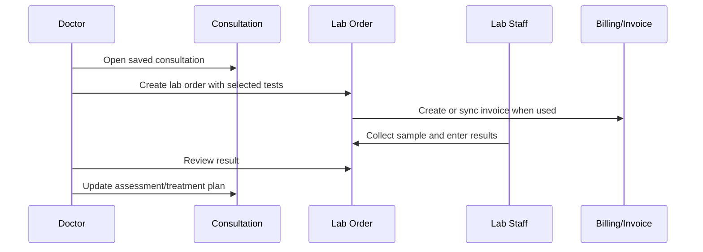

# Lab Order Workflow

## Purpose

Use this guide to request lab tests from a consultation, review lab order status, and act on results.

## Who should use this

Veterinary doctors who request diagnostics or review completed lab results.

## Before you start

- Confirm the consultation is saved.
- Confirm the patient and branch are correct.
- Select only clinically necessary active lab tests.
- Do not edit reviewed lab results.

## Summary process diagram



## Step-by-step guide

1. Open the saved consultation.
2. Click `New Lab Order`.
3. Select one or more lab tests from the picker.
4. Add sample notes if needed.
5. Submit the dialog to create the lab order.
6. Use `View Lab Orders` from the consultation to review linked orders.
7. Open the lab order to check status, requested date, requested by, service branch, lab tests, and linked invoice.
8. Lab staff normally moves the order through sample collection, in-progress work, and result entry.
9. When results are entered, review the lab order.
10. If results change the clinical plan, return to the consultation and update assessment, diagnosis, and treatment plan.

## Lab order status guide

| Status | Meaning |
|---|---|
| Draft | Order exists but is not requested. |
| Requested | Doctor has requested tests. |
| Sample Collected | Sample has been collected. |
| In Progress | Lab work is underway. |
| Result Entered | Results have been entered and need review. |
| Reviewed | Doctor review is complete; results become read-only. |
| Cancelled | Lab order is cancelled. |

## Invoice behavior

- Lab orders can link to Sales Invoice through the billing flow.
- If billing sessions are enabled, lab billing may sync into a billing session.
- If an invoice is already submitted, it cannot simply be edited from the modal.
- If a previous invoice is cancelled, the billing workflow may create or use a replacement invoice depending on configuration.

## Important notes

- Doctors can request lab tests and review lab results.
- Lab technicians can enter lab results.
- Reviewed lab results are read-only and cannot be edited.
- The order must include at least one lab test unless cancelled.
- The consultation must belong to the selected patient.

## Common mistakes

| Mistake | Better approach |
|---|---|
| Creating lab order before saving consultation | Save consultation first. |
| Selecting duplicate tests | Select each test once. |
| Editing reviewed results | Ask Lab/Admin for correction process; do not overwrite reviewed results. |
| Ignoring invoice status | Review billing modal or ask Accounts if billing is blocked. |

## What happens next

After results are available, the doctor updates the clinical assessment, diagnosis, treatment plan, planned treatments, follow-up, or hospitalisation plan as needed.

## Related records

- Veterinary Consultation
- Veterinary Lab Order
- Veterinary Lab Test
- Veterinary Lab Order Item
- Sales Invoice

## Troubleshooting

| Problem | Likely reason | What the doctor should do |
|---|---|---|
| `Select at least one lab test` | No test was selected | Select at least one active lab test. |
| Cannot create lab order | Missing doctor role, branch access, disabled platform access, or unsaved/invalid consultation | Save consultation and ask Admin to verify role/branch access. |
| Lab result cannot be edited | Status is Reviewed | Follow clinic correction process. |
| Invoice already submitted | ERPNext submitted invoices are locked | Ask Accounts to handle correction or replacement. |

## Screenshots / visual references

Pending screenshots:

- `lab-order-dialog.png`
- `lab-order-summary.png`

UI callout:

```text
+--------------------------------------------------+
| Lab Order                                        |
+--------------------------------------------------+
| 1. Patient and owner                             |
| 2. Status                                        |
| 3. Consultation link                             |
| 4. Lab tests requested                           |
| 5. Result status                                 |
| 6. Linked invoice                                |
| 7. Doctor reviewed by/on                         |
+--------------------------------------------------+
```

## Source files inspected

- `vetedge/services/lab.py`
- `vetedge/veterinary/doctype/veterinary_lab_order/veterinary_lab_order.json`
- `vetedge/veterinary/doctype/veterinary_lab_order_item/veterinary_lab_order_item.json`
- `vetedge/veterinary/doctype/veterinary_consultation/veterinary_consultation.js`
