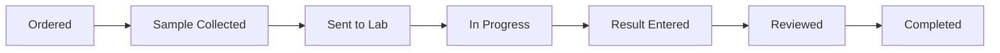

# Laboratory Operations

## Module Purpose

Progress Veterinary Lab Orders from an authorised request through traceable sample handling, result entry and practitioner review without publishing unfinished work to Medical History.

## Laboratory Workflow

## Step-by-Step Procedure

1. Open the Lab Dashboard, Lab Order Report or assigned notification.
2. Confirm Lab Order ID, patient, owner, consultation, branch, requested tests and sample instructions.
3. Record sample collection only when the correct sample is collected and labelled.
4. Progress Sent to Lab and In Progress to reflect actual custody and processing.
5. Enter results only where the selected Veterinary Lab Test and site settings allow the role to do so.
6. Attach permitted result evidence and confirm units, ranges and test identity.
7. Mark Result Entered and hand off to the authorised practitioner for clinical review.
8. Use Reviewed only after the required review is recorded.
9. Use Completed only when result entry, review and the Lab Order workflow are finished.
10. Refresh Medical History and confirm the laboratory event appears only after Completed.

## Controls

- Do not interpret or change the practitioner's diagnosis without authority.
- Do not use Completed to clear a queue when a sample, result or review is pending.
- Do not move a result to another patient record; stop and escalate a wrong-patient order.
- Billing or payment may gate progress but does not itself create laboratory history.

## Practice Exercise

Progress a synthetic Lab Order to Result Entered, demonstrate that it is absent from Medical History, complete the authorised review and then verify its appearance after Completed.

## Related Screenshots

