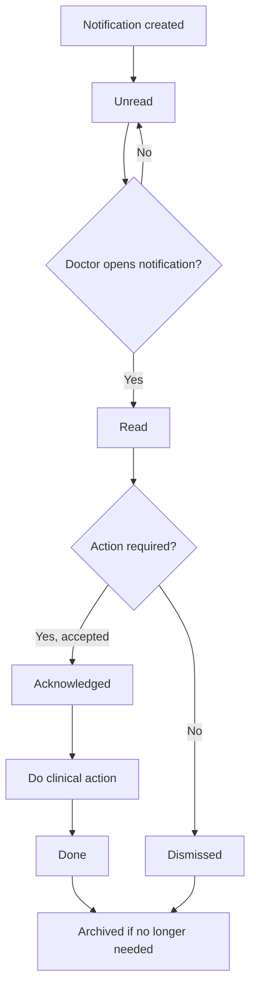

# Notifications And Action Centre Workflow

## Purpose

Use this guide to understand Veterinary notifications, what doctors may see, and how to respond without losing important clinical handoffs.

## Who should use this

Veterinary doctors who receive clinical, lab, appointment, payment, vaccination, or hospitalisation alerts.

## Before you start

- Check both the normal desk notification bell and any Veterinary notification badge/feed available on the site.
- Only mark a notification done when the clinical action is actually complete.
- Dismiss notifications only when no action is needed.

## Summary process diagram

## Step-by-step guide

1. At the start of the day, check the notification bell and Veterinary notification count.
2. Open unread notifications first.
3. Review title, message, priority, reference record, and action link.
4. Open the referenced record when the notification requires action.
5. Mark as `Read` when you have reviewed the message.
6. Mark as `Acknowledged` when you accept responsibility or confirm you are acting on it.
7. Mark as `Done` only after the work is complete.
8. Mark as `Dismissed` when the alert does not require action.
9. Archive old notifications only when they should leave the active feed.

## Notification states

| State | Meaning | Doctor action |
|---|---|---|
| Unread | Not yet opened/reviewed | Open and review. |
| Read | Reviewed but not necessarily acted on | Decide whether action is needed. |
| Acknowledged | Doctor has accepted/recognized the task | Complete the action. |
| Done | Required action is complete | No further action unless follow-up appears. |
| Dismissed | No action needed | Use carefully. |
| Archived | Removed from normal active feed | Use for old completed items. |

## Notifications doctors may see

| Notification area | Meaning | Typical response |
|---|---|---|
| Lab result entered | Lab result may require doctor review | Open lab order, review result, update consultation if needed. |
| Clinical/lab/pharmacy alert | Cross-team handoff | Open linked record and act or acknowledge. |
| Treatment or review alert | Patient needs clinical follow-up | Review patient and plan. |
| Consultation awaiting payment | Payment gate may block next clinical step | Ask Front Desk/Accounts to resolve. |
| Missed appointment | Patient did not attend | Decide if clinical follow-up is needed; Front Desk handles contact. |
| Vaccination due/overdue | Preventive care is due | Review priority and ask Front Desk to schedule/contact. |
| Hospitalisation activity/discharge alert | Inpatient action needed | Open hospitalisation and complete required action. |

## Important notes

- Notification items are per recipient user.
- The unread count is based on `Unread` Veterinary Notification Items.
- Doctors can update notification status for their own notifications.
- Admins can manage broader notification configuration.

## Common mistakes

| Mistake | Better approach |
|---|---|
| Marking Done before doing the action | Use Acknowledged first, then Done after completion. |
| Dismissing payment gate alerts | Ask Front Desk/Accounts to resolve if care is blocked. |
| Ignoring high priority lab alerts | Review linked lab order promptly. |
| Expecting count to clear after opening native bell only | Mark the Veterinary notification read/done where available. |

## What happens next

After acting on a notification, update the related clinical record so the next team member sees the current state.

## Related records

- Veterinary Notification Item
- Notification Log
- Veterinary Consultation
- Veterinary Lab Order
- Veterinary Vaccination Record
- Veterinary Appointment
- Veterinary Hospitalisation

## Troubleshooting

| Problem | Likely reason | What the doctor should do |
|---|---|---|
| Notification count not clearing | Item is still Unread | Mark it Read, Done, Dismissed, or Archive if appropriate. |
| Action link does not open | Permission or deleted/cancelled reference | Ask Admin to verify access. |
| Too many old alerts | Feed includes old non-archived items | Archive completed old items if clinic policy allows. |

## Screenshots / visual references

Pending screenshot:

- `veterinary-notification-badge.png`

## Source files inspected

- `vetedge/services/notification_api.py`
- `vetedge/services/notifications.py`
- `vetedge/services/notification_events.py`
- `vetedge/veterinary/doctype/veterinary_notification_item/veterinary_notification_item.json`
- `vetedge/services/clinical_lab_pharmacy_notifications.py`
