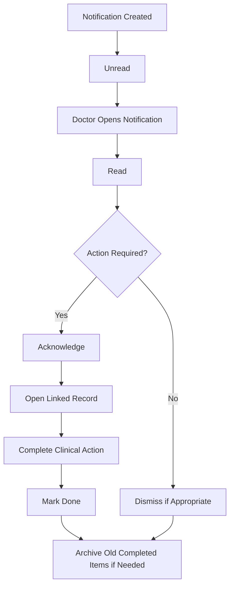

# Notifications and Action Centre Training Guide

## Module Purpose

Train veterinary doctors to use Veterinary notifications as clinical handoffs, not just messages.

## Learning Objectives

After this module, the doctor should be able to:

- Find and open Veterinary notifications.
- Understand unread, read, acknowledged, done, dismissed, and archived states.
- Open the linked patient, consultation, lab order, vaccination, appointment, or Hospitalisation record.
- Mark notifications done only after the work is complete.
- Escalate payment, permission, and missing-record issues correctly.

## Summary Process Diagram

## Step-by-Step Training Guide

1. At the start of the day, check the normal desk notification bell and any Veterinary notification badge or feed available on the site.
2. Open unread notifications first.
3. Read the title, message, priority, reference record, and action link.
4. Open the linked record when action is needed.
5. Mark the notification Read when reviewed.
6. Mark it Acknowledged when you accept responsibility or confirm you are acting on it.
7. Mark it Done only after the clinical action is complete.
8. Mark it Dismissed only when no action is needed.
9. Archive old notifications only when they should leave the active feed.

## Trainer Notes

> Trainer Note: Ask the trainee to explain the difference between Acknowledged and Done. Acknowledged means "I have seen this and will act"; Done means "the required action is finished."

> Trainer Note: Payment alerts should not be dismissed if care is blocked. They should be handed to Front Desk or Accounts.

## Practice Exercise

Scenario: A lab result notification appears for a patient seen earlier today.

Task:

1. Open the notification.
2. Open the linked lab order.
3. Review the result.
4. Decide whether the consultation needs an updated treatment plan.
5. Mark the notification Done only after the review is complete.

Expected outcome: The doctor uses notification state as a reliable clinical handoff signal.

## Notification State Guide

| State | Meaning | Doctor action |
|---|---|---|
| Unread | Not yet reviewed | Open and review. |
| Read | Reviewed but not necessarily acted on | Decide if action is needed. |
| Acknowledged | Doctor accepts or recognises the task | Complete the action. |
| Done | Required action is complete | No further action unless follow-up appears. |
| Dismissed | No action is needed | Use carefully. |
| Archived | Removed from normal active feed | Use for old completed items if clinic policy allows. |

## Common Mistakes

| Mistake | Better approach |
|---|---|
| Marking Done before completing work | Use Acknowledged first, then Done after completion. |
| Dismissing payment gate alerts | Ask Front Desk or Accounts to resolve if care is blocked. |
| Ignoring high-priority lab alerts | Open and review the linked lab order promptly. |
| Expecting the count to clear after opening only the bell | Update the Veterinary notification state where available. |

## Troubleshooting

| Problem | Likely reason | What the doctor should do |
|---|---|---|
| Notification count does not clear | Item is still Unread or active | Mark Read, Done, Dismissed, or Archive as appropriate. |
| Action link does not open | Permission issue or missing/cancelled reference | Ask Admin to verify access and record status. |
| Too many old alerts | Old items are not archived | Archive completed items if clinic policy allows. |

## Related Roles and Handoffs

| Notification type | Typical handoff |
|---|---|
| Lab result entered | Doctor reviews; Lab Technician handled result entry. |
| Consultation awaiting payment | Front Desk or Accounts resolves payment. |
| Missed appointment | Front Desk contacts owner; doctor decides clinical priority. |
| Vaccination due or overdue | Doctor reviews clinical priority; Front Desk schedules. |
| Hospitalisation action | Doctor or Nurse completes clinical action. |

## Related Screenshots

- `training_assets/screenshots/veterinary-notification-badge.png`

See [Screenshot Manifest](screenshot_manifest.md) for capture instructions.

## Related Guides

- [Veterinary Doctor Training Manual](veterinary_doctor_training_manual.md)
- [Troubleshooting and Common Errors](troubleshooting_and_common_errors.md)
