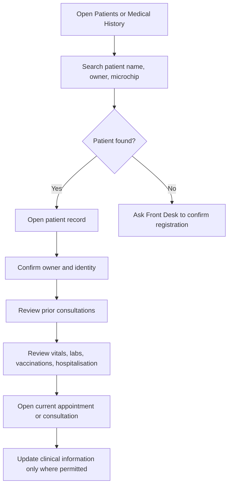

# Patient Medical Record Workflow

## Purpose

Use this guide to find a patient, review owner and clinical history, and avoid duplicate patient records.

## Who should use this

Veterinary doctors who need patient context before or during treatment.

## Before you start

- Search before creating a new patient.
- Confirm the owner before acting on the record.
- Confirm you are viewing the correct Branch context when branch restrictions are active.

## Summary process diagram



## Step-by-step guide

1. Open `Patients` from the Veterinary workspace, or open `Medical History` if you need timeline context.
2. Search by patient name, owner/customer, microchip ID, or known patient ID.
3. Open the patient record and confirm identity: patient name, species, breed, sex, neuter status, date of birth or approximate age, default branch, and microchip ID.
4. Confirm the primary owner before discussing or acting on care decisions.
5. Review registration billing fields only as context. Do not change invoice or payment status manually.
6. Open `Medical History` for patient-centric history.
7. Review previous consultations for presenting complaint, examination, assessment, diagnosis, planned treatments, and follow-up.
8. Review vitals history for trends in weight, temperature, heart rate, respiratory rate, pain score, hydration, appetite, and mucous membrane.
9. Review vaccination history and next due dates.
10. Review lab orders and results. If results are entered but not reviewed, use the lab workflow.
11. Review hospitalisation history when inpatient care occurred.
12. Open the active appointment or consultation when ready to continue the visit.

## Important notes

- Patient history is patient-centric. Cross-branch treatment is allowed, but branch access still applies.
- Vitals should be recorded in `Veterinary Vital Signs`, not only in notes.
- Owner/customer records are ERPNext-owned. Doctors should update clinical data, not accounting data.
- If a duplicate patient appears likely, stop and ask Front Desk or Admin to review before creating or editing records.

## Common mistakes

| Mistake | What to do instead |
|---|---|
| Treating the wrong patient with a similar name | Confirm owner, species, breed, and microchip. |
| Creating duplicate patients | Search first and ask Front Desk if unsure. |
| Updating owner billing details casually | Ask Front Desk or Accounts to update customer data. |
| Missing prior lab or hospitalisation history | Use Medical History before finalizing a care plan. |

## What happens next

After record review, continue to consultation, lab order, vaccination, hospitalisation, or follow-up scheduling as clinically required.

## Related records

- Veterinary Patient
- Customer
- Veterinary Consultation
- Veterinary Vital Signs
- Veterinary Lab Order
- Veterinary Vaccination Record
- Veterinary Hospitalisation
- Veterinary Appointment

## Troubleshooting

| Problem | Likely reason | What the doctor should do |
|---|---|---|
| Cannot open patient | Branch restriction or missing permission | Confirm patient branch and ask Admin to verify access. |
| Medical History shows no data | Wrong patient selected or no historical records | Confirm patient ID and date filters. |
| Owner details look wrong | Customer record needs correction | Ask Front Desk/Admin to verify customer record. |

## Screenshots / visual references

Pending screenshots:

- `patient-record-opened.png`
- `medical-history-timeline.png`

UI layout sketch:

```text
+--------------------------------------------------+
| Patient Record                                   |
+--------------------------------------------------+
| 1. Patient identity                              |
| 2. Primary owner                                 |
| 3. Species, breed, sex, age, microchip           |
| 4. Default branch                                |
| 5. Registration invoice status                   |
| 6. Related consultations, vitals, labs, vaccines |
+--------------------------------------------------+
```

## Source files inspected

- `vetedge/veterinary/doctype/veterinary_patient/veterinary_patient.json`
- `vetedge/services/medical_history.py`
- `vetedge/veterinary/page/veterinary_medical_history/veterinary_medical_history.json`
- `vetedge/services/permissions.py`
