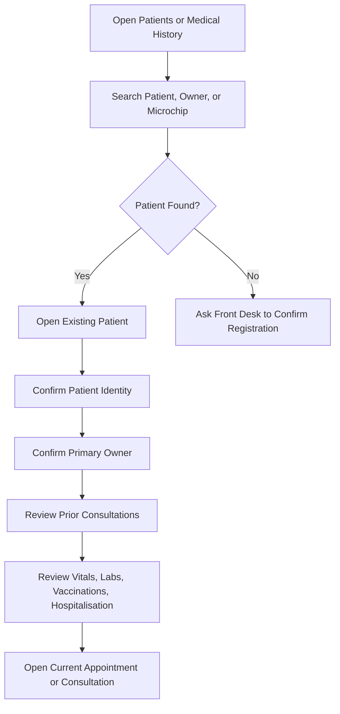

# Patient Medical Record Training Guide

## Module Purpose

Train veterinary doctors to find the correct patient, confirm the owner, review clinical history, and avoid duplicate patient records.

## Learning Objectives

After this module, the doctor should be able to:

- Search for an existing Veterinary Patient.
- Confirm patient and owner identity.
- Review patient-centric medical history.
- Find consultations, vitals, lab orders, vaccinations, and Hospitalisation records.
- Know when Front Desk or Admin should correct patient or owner details.

## Summary Process Diagram

## Step-by-Step Training Guide

1. Open Patients from the Veterinary workspace, or open Medical History when timeline context is needed.
2. Search by patient name, owner, microchip ID, or known patient ID.
3. Open the existing patient record.
4. Confirm patient name, species, breed, sex, age, microchip, and default Branch.
5. Confirm the primary owner before discussing or recording care decisions.
6. Review prior consultations for complaint, assessment, diagnosis, treatment plan, and follow-up.
7. Review Veterinary Vital Signs for trends such as weight, temperature, heart rate, respiratory rate, pain score, hydration, appetite, and mucous membrane.
8. Review vaccination, lab, and Hospitalisation history.
9. Open the current appointment or consultation when ready to continue the visit.

## Trainer Notes

> Trainer Note: Pause here and explain that doctors should not create duplicate patient records. If the patient cannot be found, Front Desk should confirm registration before a new record is created.

> Trainer Note: Explain that owner/customer records are shared with ERPNext. Doctors should update clinical information, not accounting details.

## Practice Exercise

Scenario: Two patients have the same name, but different owners.

Task:

1. Search for the patient.
2. Compare owner, species, breed, and microchip.
3. Open the correct patient record.
4. Review medical history.
5. Open the current consultation.

Expected outcome: The doctor confirms the correct patient and avoids wrong-patient documentation.

## Common Mistakes

| Mistake | Better approach |
|---|---|
| Treating the wrong patient with a similar name | Confirm owner, species, breed, and microchip. |
| Creating duplicate patients | Search first and ask Front Desk if unsure. |
| Updating owner billing details casually | Ask Front Desk or Accounts to update customer data. |
| Missing prior lab or Hospitalisation history | Use Medical History before finalising a care plan. |

## Troubleshooting

| Problem | Likely reason | What the doctor should do |
|---|---|---|
| Cannot open patient | Branch restriction or missing permission | Confirm patient Branch and ask Admin to verify access. |
| Medical History shows no data | Wrong patient selected or no historical records | Confirm patient ID and filters. |
| Owner details look wrong | Customer record may need correction | Ask Front Desk or Admin to verify the customer record. |

## Related Roles and Handoffs

| Handoff | Responsible role |
|---|---|
| New registration or duplicate review | Front Desk or Admin |
| Owner/contact/billing correction | Front Desk or Accounts |
| Clinical interpretation of history | Doctor |
| Vitals capture support | Nurse |

## Related Screenshots

- `training_assets/screenshots/patient-record-opened.png`
- `training_assets/screenshots/medical-history-timeline.png`

See [Screenshot Manifest](screenshot_manifest.md) for capture instructions.

## Related Guides

- [Veterinary Doctor Training Manual](veterinary_doctor_training_manual.md)
- [Consultation Workflow](consultation_workflow.md)
- [Glossary](glossary.md)
