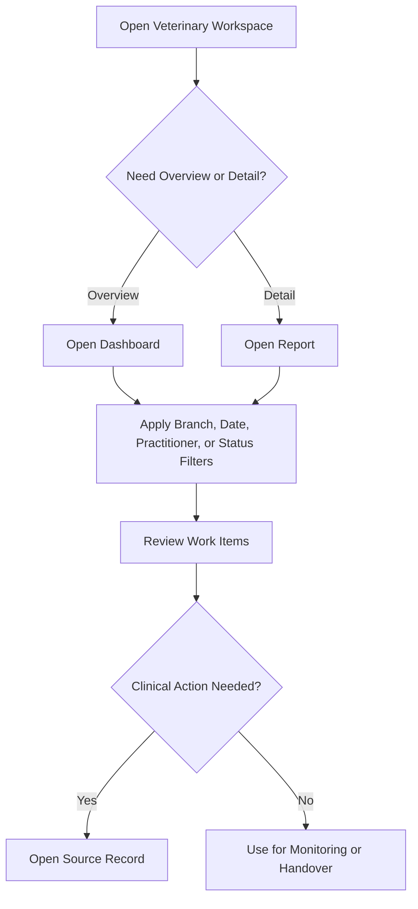

# Reports and Dashboards Training Guide

## Module Purpose

Train veterinary doctors to use reports and dashboards for daily clinical review, patient follow-up, lab review, vaccination monitoring, Hospitalisation oversight, and handover.

## Learning Objectives

After this module, the doctor should be able to:

- Choose between a dashboard and a report.
- Apply Branch, date, practitioner, and status filters.
- Open the source record before acting.
- Use doctor-accessible reports without bypassing permissions.
- Understand which reports are for Accounts, managers, stock, or other teams.

## Summary Process Diagram

## Step-by-Step Training Guide

1. Open the Veterinary workspace.
2. Use dashboards for live overviews.
3. Use reports for filtered lists and detailed review.
4. Apply Branch, date, practitioner, and status filters carefully.
5. Open the source record before taking clinical action.
6. Do not use reports to bypass record permissions, payment rules, or branch controls.
7. Treat financial totals as context only; Accounts handles payment and invoice work.

## Trainer Notes

> Trainer Note: Demonstrate how the same patient may appear in a dashboard, a report, and a source record. The source record is where the doctor should act.

> Trainer Note: Explain that an empty report may mean filters are too narrow, not that there is no work.

## Practice Exercise

Scenario: The doctor wants to find lab results waiting for review and Hospitalisation patients nearing discharge.

Task:

1. Open the Lab Dashboard or Lab Order Report.
2. Filter for result-entered or pending-review work where available.
3. Open one source lab order.
4. Open Hospitalisation Dashboard or Hospitalisation Discharge Watch.
5. Open one source Hospitalisation record.

Expected outcome: The doctor uses reports and dashboards to find work, then completes action from the correct source record.

## Doctor-Accessible Dashboards

| Dashboard | Route | Training purpose |
|---|---|---|
| Clinical Dashboard | `/app/vetedge-clinical-dashboard` | Review clinical activity and open consultations or patients. |
| Lab Dashboard | `/app/vetedge-lab-dashboard` | Review lab order status and pending results. |
| Vaccination Dashboard | `/app/vetedge-vaccination-dashboard` | Review due, overdue, and upcoming preventive care. |
| Practitioner Performance Dashboard | `/app/vetedge-practitioner-performance-dashboard` | Review doctor workload and activity. |
| Hospitalisation Dashboard | `/app/veterinary-hospitalisation-dashboard` | Review active inpatient care and discharge readiness. |

## Doctor-Accessible Reports

| Report | Use |
|---|---|
| Consultation Register | Review consultation status and open records needing action. |
| Planned Treatment | Review planned treatment follow-up and handoffs. |
| Patient Register | Find registered patients. |
| Practitioner Performance Report | Review doctor workload; doctors may be limited to self view. |
| Lab Order Report | Find requested, result-entered, or reviewed lab orders. |
| Vaccination Report | Review administered, due, overdue, and upcoming vaccines. |
| Active Hospitalisations | Review current admitted patients. |
| Hospitalisation Charge Summary | Review charge context and hand off billing issues. |
| Care Location Occupancy | Review care location usage. |
| Hospitalisation Discharge Watch | Identify discharge-ready or blocked patients. |
| Pending Hospitalisation Actions | Find incomplete inpatient actions. |

## Reports Not Normally Doctor-Focused

These may exist but are not doctor-focused unless another role grants access:

- Owner Register
- Branch Performance Report
- Branch Performance Summary
- Revenue Summary
- Unpaid Invoice Report
- Dispensary Activity Report
- Stock Usage Summary
- Stock Expiry Status
- Boarding Report
- Kennel Availability Report
- Grooming Report

Access should be verified in Role Permission Manager if a live site differs.

## Common Mistakes

| Mistake | Better approach |
|---|---|
| Assuming a report shows all branches | Check Branch filter and assignment. |
| Acting from a report without opening the source record | Open the patient, consultation, lab, vaccination, or Hospitalisation record. |
| Expecting financial reports as a doctor | Ask Accounts or a manager for financial review. |
| Ignoring date filters | Confirm the selected date range. |

## Troubleshooting

| Problem | What the doctor should do |
|---|---|
| Report shows no data | Check filters, Branch access, date range, and whether records exist. |
| Dashboard does not open | Ask Admin to verify role and page access. |
| Source record cannot be opened | Ask Admin or Branch Manager to verify permission and Branch access. |

## Related Roles and Handoffs

| Handoff | Responsible role |
|---|---|
| Financial report review | Accounts or manager |
| Stock and dispensary reports | Pharmacy, Dispensary, stock team, or manager |
| Clinical source record action | Doctor |
| Follow-up appointment after report review | Front Desk |

## Related Screenshots

- `training_assets/screenshots/doctor-dashboard-overview.png`
- `training_assets/screenshots/doctor-reports-list.png`
- `training_assets/screenshots/vaccination-dashboard.png`

See [Screenshot Manifest](training-module:screenshot-manifest) for capture instructions.

## Related Guides

- [Veterinary Home and EdgeSuite Daily Start](training-module:shared-veterinary-home)
- [Veterinary Doctor Training Manual](training-module:doctor-overview)
- [Role Access Matrix](training-module:role-access)
- [Troubleshooting and Common Errors](training-module:troubleshooting)
