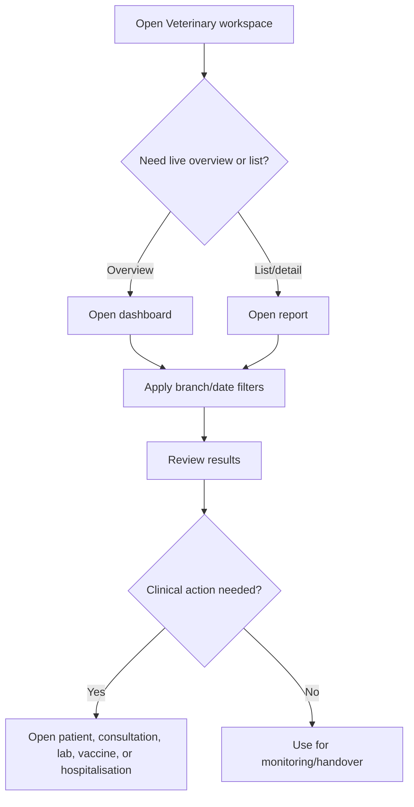

# Reports And Dashboards Workflow

## Purpose

Use this guide to understand reports and dashboards available to doctors.

## Who should use this

Veterinary doctors reviewing their clinical workload, patient lists, planned treatments, lab activity, vaccination due items, and hospitalisation status.

## Before you start

- Reports may be filtered by your assigned Branch.
- Practitioner performance is locked to your own practitioner user unless you also have manager/admin access.
- Financial and stock reports are generally not doctor reports unless another role grants access.

## Summary process diagram

## Step-by-step guide

1. Open the Veterinary workspace.
2. For overview, open a doctor-accessible dashboard.
3. For tabular review, open a doctor-accessible report.
4. Apply Branch, date, practitioner, or status filters as available.
5. Open the source record when the report shows a patient needing action.
6. Do not use reports to bypass record permissions or payment rules.

## Doctor-accessible dashboards

| Dashboard | Route | Purpose | Common action |
|---|---|---|---|
| Clinical Dashboard | `vetedge-clinical-dashboard` | Clinical activity overview | Open consultations/patients needing attention. |
| Lab Dashboard | `vetedge-lab-dashboard` | Lab order status overview | Follow up Result Entered or pending lab work. |
| Vaccination Dashboard | `vetedge-vaccination-dashboard` | Vaccination due/overdue overview | Ask Front Desk to schedule or contact owners. |
| Practitioner Performance Dashboard | `vetedge-practitioner-performance-dashboard` | Doctor performance/workload | Review own consultation activity. |
| Hospitalisation Dashboard | `veterinary-hospitalisation-dashboard` | Active inpatient overview | Review pending actions/discharge readiness. |

## Doctor-accessible reports

| Report | Where to find it | Purpose | Key filters | How to interpret | Common action |
|---|---|---|---|---|---|
| Consultation Register | Reports / Veterinary Records | Consultation list and status review | Branch, date, practitioner, status | Finds open, awaiting payment, completed, or cancelled consultations | Open consultation and update care. |
| Planned Treatment | Reports | Planned treatment follow-up | Branch, date, status | Shows planned treatments needing attention | Coordinate with nurse/dispensary. |
| Patient Register | Reports | Patient list | Branch, species/status | Finds registered patients | Open patient record. |
| Practitioner Performance Report | Reports | Doctor activity/performance | Date, branch, practitioner | Doctors see self view unless manager/admin | Review workload and productivity. |
| Lab Order Report | Reports | Lab status list | Branch, date, status | Finds requested, result entered, reviewed labs | Review results or follow up lab. |
| Vaccination Report | Reports | Vaccination and due/overdue list | Branch, date, status | Identifies administered and upcoming vaccines | Schedule preventive care. |
| Active Hospitalisations | Hospitalisation section | Current admitted patients | Branch/status | Shows active inpatients | Review rounds. |
| Hospitalisation Charge Summary | Hospitalisation section | Hospitalisation charge context | Branch/date | Shows billing/charge state | Ask Accounts to resolve pending charges. |
| Care Location Occupancy | Hospitalisation section | Location occupancy | Branch/location | Shows care location usage | Plan admissions/transfers. |
| Hospitalisation Discharge Watch | Hospitalisation section | Discharge readiness watch | Branch/status | Identifies patients near discharge or blocked | Run readiness/discharge workflow. |
| Pending Hospitalisation Actions | Hospitalisation section | Pending activity/action list | Branch/status | Shows incomplete inpatient actions | Complete or assign action. |

## Reports not currently doctor-focused

These exist but are not doctor-accessible in the discovered report role map unless another role grants access:

- Owner Register
- Branch Performance Report
- Branch Performance Summary
- Revenue Summary
- Unpaid Invoice Report
- Dispensary Activity Report
- Stock Usage Summary
- Stock Expiry Status
- Boarding Report
- Kennel Availability Report
- Grooming Report

## Important notes

- Report visibility is enforced server-side.
- Branch filters may be defaulted based on your assigned branch.
- Doctors should treat financial totals as context, not as permission to change accounting records.

## Common mistakes

| Mistake | Better approach |
|---|---|
| Assuming report shows all branches | Check branch filter and assignments. |
| Expecting financial reports as doctor | Ask Accounts/Manager for financial review. |
| Ignoring empty filters | Clear date/status filters or verify branch access. |

## What happens next

Use dashboards and reports to open the source record and complete the clinical action in the proper workflow.

## Related records

- Veterinary Consultation
- Veterinary Patient
- Veterinary Lab Order
- Veterinary Vaccination Record
- Veterinary Hospitalisation
- Veterinary Appointment

## Troubleshooting

If a report shows no data, confirm filters, branch access, role access, and whether records exist for the selected period.

## Screenshots / visual references

Pending screenshots:

- `doctor-dashboard-overview.png`
- `doctor-reports-list.png`
- `vaccination-dashboard.png`

## Source files inspected

- `vetedge/services/report_visibility.py`
- `vetedge/workspace_sidebar/vetedge.json`
- `vetedge/veterinary/page/*/*.json`
- `vetedge/veterinary/report/*/*.json`
