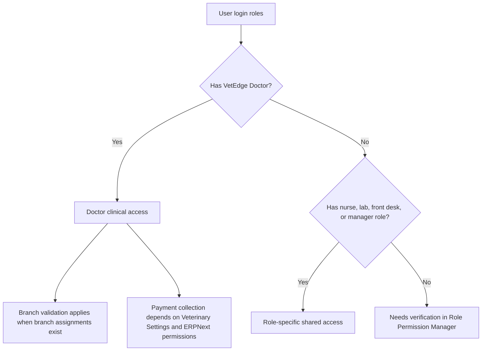

# Veterinary Doctor Role Access Matrix

## Purpose

This document explains what doctor-related roles can access in the current Veterinary codebase.

## Summary process diagram

## Role discovery

| Role or bundle | Type | Evidence | Notes |
|---|---|---|---|
| `VetEdge Doctor` | Primary doctor role | Permission constants, DocType permissions, workspace links, page/report roles | Main veterinary doctor role discovered in code. |
| `Veterinary Doctor` | Starter role bundle | `STARTER_ROLE_BUNDLES` | Adds `VetEdge Doctor`, `Desk User`, `Accounts User`, `Sales User`, and `Stock User`. |
| `System Manager` | Elevated admin role | Permission constants | Has elevated access; not treated as an operational doctor role. |
| `VetEdge Administrator` | Elevated admin role | Permission constants | Has elevated access; not treated as an operational doctor role. |
| `Veterinary Nurse` / `VetEdge Nurse` | Clinical support role | Permission aliases and shared workflow access | Can use several clinical records but is not a doctor role. Included for handoff context. |
| `Lab Technician` / `VetEdge Lab Technician` | Lab role | Permission aliases | Can enter lab results; doctor reviews results. |
| `Branch Manager` / `VetEdge Branch Manager` | Manager role | Permission aliases and report visibility | Can view clinical/hospitalisation reporting. |

No separate explicit roles named clinician, surgeon, consultant, senior vet, or clinical supervisor were found. If those titles exist on a live site, verify them in Role Permission Manager.

## Access matrix

| Role | Can view patients | Can create consultation | Can edit consultation | Can create lab order | Can review lab result | Can record vaccination | Can admit hospitalisation | Can discharge | Can view reports | Notes |
|---|---:|---:|---:|---:|---:|---:|---:|---:|---:|---|
| `VetEdge Doctor` | Yes | Yes | Yes | Yes | Yes | Yes | Yes | Yes | Yes | Branch restrictions may apply. Clinical diagnosis/treatment capture requires doctor role. |
| `Veterinary Doctor` bundle | Yes | Yes | Yes | Yes | Yes | Yes | Yes | Yes | Yes | Bundle grants `VetEdge Doctor` plus ERPNext desk, accounts, sales, and stock roles. |
| `Veterinary Nurse` / `VetEdge Nurse` | Yes | Yes | Yes | No | No | Can administer vaccines | Yes | Yes | Some | Included for handoff context; lab request/review is doctor-only. |
| `Lab Technician` / `VetEdge Lab Technician` | Yes | No | No | No | No | No | No | No | Lab reports | Can enter/update lab results. |
| `VetEdge Front Desk` | Yes | Yes | Yes | No | No | Can create vaccination draft | Yes | Yes | Some | Handles appointment and billing handoffs. |
| `Branch Manager` / `VetEdge Branch Manager` | Read mostly | Read mostly | Read mostly | No | No | Limited by permissions | Read/reporting | Read/reporting | Yes | Manager visibility, not primary clinical capture. |

## Doctor-accessible DocTypes

| Record | Doctor access found | Practical meaning |
|---|---|---|
| Veterinary Patient | Create, read, write, report | Doctors can open and update patient records, but should avoid duplicate creation. |
| Veterinary Appointment | Create, read, write, report | Doctors can review appointment status and linked consultations. |
| Veterinary Consultation | Create, read, write, report | Main clinical workflow. |
| Veterinary Vital Signs | Create, read, write, report | Vitals are separate records, not part of the consultation table. |
| Veterinary Lab Order | Create, read, write, report | Doctors can request labs and review results. |
| Veterinary Vaccination Record | Create, read, write, report | Doctors can record/administer vaccinations subject to settings and payment enforcement. |
| Veterinary Hospitalisation | Create, read, write, report | Doctors can admit, manage activities, and discharge if readiness checks pass. |
| Veterinary Notification Item | Read, write, report | Doctors can manage their own notification state. |
| Sales Invoice | Workspace-visible | Invoice access depends on ERPNext permissions and role bundle. |
| Payment Entry | Not shown to doctors in workspace | Accounts/Branch Manager handles normal payment entry unless doctor payment collection is enabled in settings. |

## Doctor-accessible pages and dashboards

| Page or dashboard | Route | Access evidence |
|---|---|---|
| Clinical Dashboard | `vetedge-clinical-dashboard` | Workspace and dashboard role map include `VetEdge Doctor`. |
| Lab Dashboard | `vetedge-lab-dashboard` | Workspace and dashboard role map include `VetEdge Doctor`. |
| Vaccination Dashboard | `vetedge-vaccination-dashboard` | Workspace and dashboard role map include `VetEdge Doctor`. |
| Practitioner Performance Dashboard | `vetedge-practitioner-performance-dashboard` | Workspace and dashboard role map include `VetEdge Doctor`; practitioner view is locked to self unless elevated/manager. |
| Hospitalisation Dashboard | `veterinary-hospitalisation-dashboard` | Workspace and dashboard role map include `VetEdge Doctor`. |
| Appointment Queue | `veterinary-appointment-queue` | Workspace page role includes `VetEdge Doctor`. |
| Medical History | `veterinary-medical-history` | Workspace page role includes `VetEdge Doctor`. |

## Doctor-accessible reports

| Report | Doctor access | Notes |
|---|---:|---|
| Consultation Register | Yes | Branch scoped. |
| Planned Treatment | Yes | Branch scoped. |
| Patient Register | Yes | Branch scoped. |
| Practitioner Performance Report | Yes | Doctors are locked to their own practitioner view unless manager/admin. |
| Lab Order Report | Yes | Branch scoped. |
| Vaccination Report | Yes | Branch scoped. |
| Active Hospitalisations | Yes | Branch scoped. |
| Hospitalisation Charge Summary | Yes | Branch scoped; includes billing context. |
| Care Location Occupancy | Yes | Branch scoped. |
| Hospitalisation Discharge Watch | Yes | Branch scoped. |
| Pending Hospitalisation Actions | Yes | Branch scoped. |
| Owner Register | No for doctor in report role map | Front desk/manager/admin only. Doctors may still view Customer links if permitted by ERPNext roles. |
| Financial, revenue, unpaid invoice reports | No for doctor in report role map | Accounts/manager/admin focus. |
| Dispensary and stock reports | No for doctor in report role map | Dispensary/manager/admin focus, although doctors may view Item links through workspace. |

## Important notes

- Branch access is server-side. If a doctor is assigned to branches, selecting another branch may be blocked.
- Diagnosis and prescribed treatment capture are doctor-only in the service layer.
- Lab request and lab result review are doctor-only. Lab result entry is for lab staff and doctors.
- Payment collection by doctors is controlled by Veterinary Settings and ERPNext permissions.
- If exact live access differs, verify the user’s roles, role bundle, and Role Permission Manager entries on the site.

## Source files inspected

- `vetedge/services/permissions.py`
- `vetedge/services/role_bundles.py`
- `vetedge/services/report_visibility.py`
- `vetedge/workspace_sidebar/vetedge.json`
- `vetedge/veterinary/doctype/*/*.json`
- `vetedge/veterinary/page/*/*.json`
- `vetedge/veterinary/report/*/*.json`
