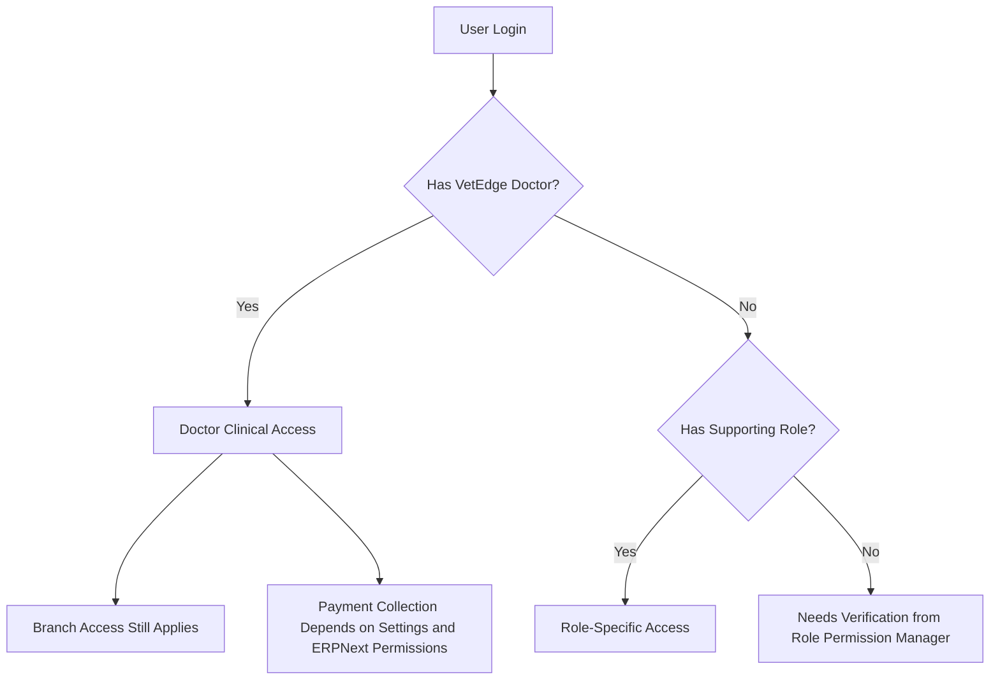

# Veterinary Doctor Role Access Matrix

## Module Purpose

Help trainers explain what doctors can usually access in VetEdge and when live permissions must be verified.

## Learning Objectives

After this module, the trainer should be able to:

- Explain the main doctor role and supporting roles.
- Describe what doctors can normally view or update.
- Explain common handoffs to Front Desk, Accounts, Lab, Pharmacy, Dispensary, Nurses, and Admin.
- Explain doctor-facing access boundaries for Veterinary masters, grooming, and boarding.
- Mark uncertain live-site access as needing verification from Role Permission Manager.

## Summary Process Diagram

## Step-by-Step Training Guide

1. Confirm the doctor's login has `VetEdge Doctor` or the `Veterinary Doctor` role bundle.
2. Confirm the doctor can open the Veterinary workspace.
3. Confirm the correct Branch assignment if the clinic uses branch restrictions.
4. Confirm the doctor can open patients, consultations, lab orders, vaccination records, Hospitalisation records, notifications, reports, and dashboards used in training.
5. Confirm whether grooming or boarding records are visible only if the doctor has extra service roles.
6. If any access differs from this guide, mark it as Needs verification from Role Permission Manager.

## Trainer Notes

> Trainer Note: Role names in a live clinic may include custom titles. Do not guess access from job title alone. Check assigned roles and Role Permission Manager.

> Trainer Note: Doctors may see billing or payment status, but invoice submission, payment collection, and submitted invoice correction normally belong to Accounts or Cashier.

## Main Roles Explained

| Role or bundle | Plain-language meaning | Trainer note |
|---|---|---|
| `VetEdge Doctor` | Main doctor role for clinical work | Use this as the primary training role. |
| `Veterinary Doctor` role bundle | Starter bundle that may include doctor plus ERPNext desk/account/sales/stock access | Live access may vary by site configuration. |
| `Veterinary Nurse` / `VetEdge Nurse` | Clinical support for vitals, care activities, and some treatment support | Nurse does not replace doctor clinical responsibility. |
| `Lab Technician` / `VetEdge Lab Technician` | Lab processing and result entry role | Doctor reviews results. |
| `VetEdge Front Desk` | Registration, appointment, owner contact, and some workflow coordination | Front Desk handles check-in and scheduling. |
| `Branch Manager` / `VetEdge Branch Manager` | Branch oversight and reporting | May view broader reports. |
| `VetEdge Administrator` / `System Manager` | Administrative access | Not a normal doctor training role. |
| Other custom roles | Site-specific | Needs verification from Role Permission Manager. |

## Trainer-Friendly Access Matrix

| Area | Doctor usually can | Handoff when outside doctor scope | Verification note |
|---|---|---|---|
| Veterinary Patient | Open, review, and update clinical context where permitted | Front Desk/Admin handles duplicate or registration corrections | Needs verification from Role Permission Manager if blocked. |
| Veterinary Appointment | Review appointment and linked consultation | Front Desk handles check-in, scheduling, and owner contact | Needs verification from Role Permission Manager if blocked. |
| Veterinary Consultation | Create, edit, and complete clinical documentation | Front Desk/Accounts handles payment blocks | Needs verification from Role Permission Manager if blocked. |
| Veterinary Vital Signs | Create and review vitals | Nurse may assist with capture | Needs verification from Role Permission Manager if blocked. |
| Veterinary Lab Order | Request tests and review results | Lab Technician processes samples and enters results | Needs verification from Role Permission Manager if blocked. |
| Veterinary Vaccination Record | Record vaccination decision and administration where allowed | Front Desk schedules; Accounts handles payment; stock team handles stock issues | Needs verification from Role Permission Manager if blocked. |
| Veterinary Hospitalisation | Admit, manage care, and discharge where readiness checks pass | Nurse, Accounts, Pharmacy/Dispensary, and stock team support handoffs | Needs verification from Role Permission Manager if blocked. |
| Veterinary Notification Item | Read, acknowledge, complete, dismiss, or archive own notifications | Admin supports notification configuration | Needs verification from Role Permission Manager if blocked. |
| Sales Invoice | May view related status depending on role bundle and settings | Accounts or Cashier handles submission, payment, and correction | Needs verification from Role Permission Manager if blocked. |
| Payment Entry | Usually not a doctor action | Accounts or Cashier records payments | Needs verification from Role Permission Manager if visible or blocked. |
| Clinical Veterinary masters | Several clinical masters have `VetEdge Doctor` create/read/write rows, including Consultation Type, Service Type, Treatment Type, Treatment Item, Lab Test, Vaccine, Species, Breed, Symptom, Diagnosis, and Diagnosis Category | Admin or Branch Manager should own cleanup and naming policy | Doctors should avoid casual duplicate creation even when permissions allow it. |
| Veterinary Care Location | No `VetEdge Doctor` DocType permission row found, though workspace visibility may show Care Locations in Hospitalisation context | Branch Manager/Admin manages care locations | Needs verification from Role Permission Manager. |
| Pet Grooming Appointment / Session / Service | No `VetEdge Doctor` DocType permission row found | Front Desk, Groomer, Branch Manager, or Admin owns service workflow | Doctors handle medical-safety review only unless extra roles are granted. Needs verification from Role Permission Manager. |
| Pet Boarding Booking / Stay / Care Record / Kennel | No `VetEdge Doctor` DocType permission row found | Front Desk, boarding staff, Branch Manager, or Admin owns service workflow | Doctors handle medical clearance/escalation only unless extra roles are granted. Needs verification from Role Permission Manager. |

## Doctor-Accessible Pages and Dashboards

| Page or dashboard | Route | Training use |
|---|---|---|
| Clinical Dashboard | `/app/vetedge-clinical-dashboard` | Clinical overview. |
| Lab Dashboard | `/app/vetedge-lab-dashboard` | Lab order overview. |
| Vaccination Dashboard | `/app/vetedge-vaccination-dashboard` | Due, overdue, and upcoming preventive care. |
| Practitioner Performance Dashboard | `/app/vetedge-practitioner-performance-dashboard` | Doctor activity and workload. |
| Hospitalisation Dashboard | `/app/veterinary-hospitalisation-dashboard` | Inpatient overview. |
| Appointment Queue | `/app/veterinary-appointment-queue` | Daily queue. |
| Medical History | `/app/veterinary-medical-history` | Patient-centric history. |
| Grooming Dashboard | `/app/vetedge-grooming-dashboard` | Not doctor-accessible in verified page/report role maps. Needs verification from Role Permission Manager if visible. |
| Boarding Dashboard | `/app/vetedge-boarding-dashboard` | Not doctor-accessible in verified page/report role maps. Needs verification from Role Permission Manager if visible. |

## Doctor-Accessible Reports

| Report | Training use |
|---|---|
| Consultation Register | Review consultation status and open records needing action. |
| Planned Treatment | Review planned treatments and handoffs. |
| Patient Register | Find patients. |
| Practitioner Performance Report | Review own activity where restricted to self view. |
| Lab Order Report | Review lab order status. |
| Vaccination Report | Review vaccination and due/overdue items. |
| Active Hospitalisations | Review admitted patients. |
| Hospitalisation Charge Summary | Understand charge context and hand off billing issues. |
| Care Location Occupancy | Review care location usage. |
| Hospitalisation Discharge Watch | Review discharge readiness. |
| Pending Hospitalisation Actions | Review incomplete inpatient actions. |
| Grooming Report | Not doctor-accessible in verified report role map. |
| Boarding Report | Not doctor-accessible in verified report role map. |
| Kennel Availability Report | Not doctor-accessible in verified report role map. |

## Practical Exercise

Scenario: A new doctor says they can open consultations but cannot open the Lab Dashboard.

Task:

1. Confirm the doctor's assigned role.
2. Confirm the route they are trying to open.
3. Check whether other doctors can open it.
4. Mark the issue as Needs verification from Role Permission Manager.
5. Escalate to Admin with user, role, route, and screenshot.

Expected outcome: The trainer does not guess permissions and escalates with the right details.

## Common Mistakes

| Mistake | Better approach |
|---|---|
| Assuming job title equals system access | Check assigned roles. |
| Telling doctors to work around branch blocks | Ask Admin or Branch Manager to verify branch access. |
| Treating billing visibility as payment authority | Ask Accounts or Cashier to handle payment. |
| Guessing custom-role access | Mark as Needs verification from Role Permission Manager. |
| Assuming doctors can operate grooming or boarding records | Treat as service handoff unless extra roles are verified. |

## Troubleshooting

| Problem | What to check |
|---|---|
| Doctor cannot see Veterinary workspace | Desk access, role bundle, workspace visibility. |
| Doctor cannot open patient or consultation | Role, Branch assignment, record status. |
| Doctor cannot open report | Report role map and Role Permission Manager. |
| Doctor sees financial actions unexpectedly | Verify role bundle and ERPNext permissions. |

## Related Roles and Handoffs

| Handoff | Responsible role |
|---|---|
| Role verification | Admin |
| Branch assignment | Admin or Branch Manager |
| Payment collection and invoice correction | Accounts or Cashier |
| Appointment coordination | Front Desk |

## Related Screenshots

- `training_assets/screenshots/doctor-reports-list.png`
- `training_assets/screenshots/doctor-dashboard-overview.png`

See [Screenshot Manifest](training-module:screenshot-manifest) for capture instructions.

## Related Guides

- [Veterinary Doctor Training Manual](training-module:doctor-overview)
- [Reports and Dashboards Workflow](training-module:reports-dashboards)
- [Troubleshooting and Common Errors](training-module:troubleshooting)
