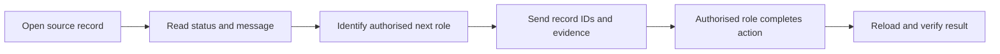

# Safe Workflow Handoffs and Submitted-Document Control

## Module Purpose

Transfer incomplete work to the authorised role without losing record identity, bypassing a workflow gate or changing submitted ERPNext records.

## Responsibility Chain

## Required Handoff Information

1. User and assigned role.
2. Company, branch and current route.
3. Source DocType and document ID.
4. Patient, appointment, consultation, Lab Order, Vaccination Record or Hospitalisation ID as applicable.
5. Sales Invoice, Payment Entry, Billing Session, Item, Batch, Warehouse or Stock Entry ID when relevant.
6. Exact status, message, attempted action and time.
7. A protected screenshot using synthetic or appropriately masked information.

## Non-Negotiable Controls

- Do not mark an invoice paid manually.
- Do not edit a submitted Sales Invoice, Payment Entry or Stock Entry to force a VetEdge workflow.
- Do not backdate or change clinical status merely to make Medical History appear complete.
- Do not substitute an expired batch or another warehouse silently.
- Do not grant broad roles to work around a permission error.
- Correct submitted-document errors through the accountant-approved cancellation, return, amendment, credit or reconciliation process.

## Practice Exercise

Read a trainer-provided payment, stock or permission message. Prepare a complete handoff to the correct role and state what must be verified after the authorised action.

## Related Screenshots

