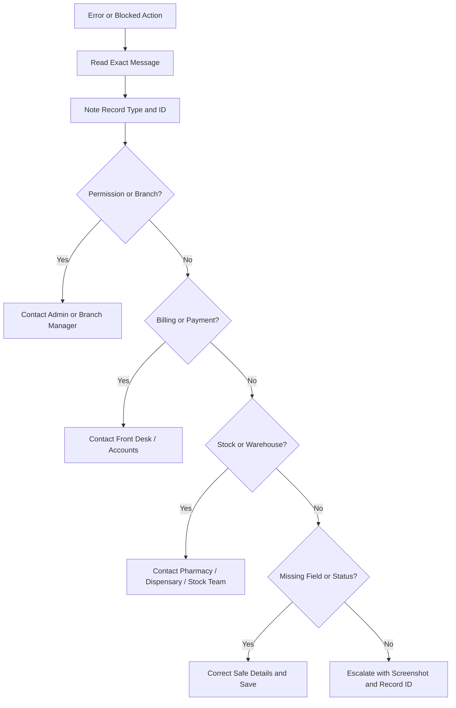

# Troubleshooting and Common Errors Training Guide

## Module Purpose

Train doctors and trainers to respond safely when VetEdge blocks an action, shows a warning, or displays an error.

## Learning Objectives

After this module, the doctor should be able to:

- Read and report the exact message shown by the system.
- Identify whether an issue is clinical, permission, branch, billing, stock, or settings related.
- Contact the correct team without bypassing controls.
- Provide useful escalation details.
- Protect submitted invoices and accounting accuracy.

## Summary Process Diagram

## Step-by-Step Training Guide

1. Stop and read the exact message.
2. Note the record type and record ID.
3. Check whether the issue mentions permission, Branch, payment, invoice, stock, warehouse, feature settings, missing fields, or record status.
4. Take only safe actions suggested by the message, such as saving the record or selecting a required field.
5. Do not bypass accounting, payment, stock, branch, or permission controls.
6. Contact the correct team using the table below.
7. Include screenshot, page route, record ID, patient, Branch, and the action attempted.

## Trainer Notes

> Trainer Note: Ask trainees to read the error aloud. Many support issues are resolved faster when the exact message is captured.

> Trainer Note: Reinforce that submitted invoices are protected. Doctors should not manually alter submitted invoices or mark invoices paid.

## Practice Exercise

Scenario: A doctor tries to complete a consultation and sees a payment gate message.

Task:

1. Read the message.
2. Identify whether it is a billing/payment issue.
3. Note the consultation ID and invoice ID if visible.
4. Explain which team should resolve it.
5. Continue only after the correct team resolves the block.

Expected outcome: The doctor pauses, escalates to Front Desk or Accounts, and does not bypass the payment gate.

## Common Issues

| Problem | Likely reason | What the doctor should do | Who to contact |
|---|---|---|---|
| Cannot see Veterinary workspace | Missing doctor/desk access | Ask for role check | Admin |
| Cannot open patient | Branch restriction, missing permission, or wrong patient | Confirm patient and Branch | Admin/Branch Manager |
| Cannot start consultation | Appointment not ready, missing patient, missing Branch, or permission issue | Ask Front Desk to check appointment and registration | Front Desk/Admin |
| Master value not available | Master list may not be configured or active | Do not create a duplicate casually; ask for master review | Admin/Branch Manager |
| Wrong consultation/service type selected | Similar or duplicate master values | Correct only if safe; if billing/reporting is affected, ask for review | Admin/Accounts |
| Save required before lab order | Consultation has unsaved changes | Save consultation, then create lab order | Doctor |
| Payment gate blocks completion | Payment or invoice action is required | Ask payment team to resolve | Front Desk/Accounts |
| Billing / Payment button missing | Feature, status, or access issue | Save record and ask for settings/access check | Admin/Accounts |
| Lab order cannot be edited | Lab order is Reviewed or Cancelled | Follow correction process | Lab/Admin |
| Select at least one lab test | No test selected | Select an active lab test | Doctor |
| Invoice already submitted | Submitted invoice is protected | Ask Accounts to handle correction or replacement | Accounts |
| Cancelled invoice replacement needed | Linked invoice was cancelled | Ask Accounts to regenerate or sync through supported flow | Accounts |
| Vaccination feature disabled | Settings disabled vaccination | Do not create workaround records | Admin |
| Cannot administer vaccine | Payment, status, role, or Branch issue | Resolve listed issue | Admin/Accounts |
| Stock shortage during Hospitalisation | Item quantity unavailable | Do not post stock; ask stock team to review | Pharmacy/Stock |
| Missing warehouse | Branch warehouse not configured | Stop stock posting and report Branch/record | Pharmacy/Admin |
| Cannot discharge patient | Pending stock, charges, invoice, payment, or discharge details | Run readiness check and resolve listed items | Accounts/Stock/Admin |
| Cannot access grooming record | Doctor role is not in verified grooming record permissions or live roles differ | Ask Front Desk/Grooming Staff for context; verify access only if required | Front Desk/Grooming Staff/Admin |
| Grooming request has medical concern | Wound, parasite, infection, pain, anxiety, handling risk, or recent procedure may make grooming unsafe | Review patient record and recommend consultation if needed | Doctor/Front Desk/Grooming Staff |
| Cannot access boarding record | Doctor role is not in verified boarding record permissions or live roles differ | Ask Front Desk/boarding staff for context; verify access only if required | Front Desk/Boarding Staff/Admin |
| Boarding patient has overdue vaccination | Preventive care may be required by clinic policy before boarding | Review vaccination history and advise Front Desk/Pet Owner | Doctor/Front Desk |
| Boarding patient develops health concern | Boarding issue may now require clinical care | Start consultation or Hospitalisation as appropriate | Doctor/Nurse/Front Desk |
| Billing/payment issue on grooming or boarding | Service invoice or payment gate needs action | Do not alter submitted invoices; ask Accounts or Cashier to resolve | Front Desk/Accounts |
| Notification count not clearing | Notification still active | Mark Read, Done, Dismissed, or Archive as appropriate | Doctor/Admin |
| Report shows no data | Filters, Branch restriction, or no records | Check date/status/Branch filters | Admin if still blocked |
| Permission denied | Role or Branch access blocks action | Capture details and escalate | Admin/Branch Manager |
| Feature disabled | Veterinary Settings flag is off | Do not work around it | Admin |

## Common Mistakes

| Mistake | Better approach |
|---|---|
| Clicking around without reading the message | Read and capture the exact message first. |
| Asking the wrong team | Match issue type to the handoff table. |
| Bypassing payment or invoice checks | Involve Front Desk or Accounts. |
| Treating stock errors as clinical notes | Involve Pharmacy, Dispensary, or stock team. |
| Treating grooming or boarding as clinical records | Use consultation or Hospitalisation when clinical care is required. |
| Reporting "it does not work" without record ID | Include route, record ID, screenshot, and action attempted. |

## Escalation Details to Capture

- Doctor login/email.
- Patient ID.
- Record type and record ID.
- Branch.
- Page route.
- Exact message.
- Screenshot.
- Action attempted.
- Sales Invoice ID, if visible for billing issues.
- Item, quantity, warehouse, and Hospitalisation ID for stock issues.

## Related Roles and Handoffs

| Issue type | Responsible role |
|---|---|
| Registration, appointment, check-in | Front Desk |
| Payment, invoice, submitted invoice correction | Accounts or Cashier |
| Role or permission | Admin |
| Branch restriction | Admin or Branch Manager |
| Lab result correction | Lab Technician/Admin |
| Stock shortage, warehouse, batch | Pharmacy, Dispensary, or stock team |
| Clinical documentation | Doctor |
| Grooming scheduling, service completion, and service notes | Front Desk or Grooming Staff |
| Boarding booking, kennel assignment, and routine care records | Front Desk or boarding staff |

## Related Screenshots

- `training_assets/screenshots/billing-payment-modal.png`
- `training_assets/screenshots/discharge-readiness-checklist.png`
- `training_assets/screenshots/veterinary-notification-badge.png`
- `training_assets/screenshots/veterinary-master-selection-example.png`
- `training_assets/screenshots/grooming-service-record.png`
- `training_assets/screenshots/boarding-service-record.png`

See [Screenshot Manifest](training-module:screenshot-manifest) for capture instructions.

## Related Guides

- [Veterinary Doctor Training Manual](training-module:doctor-overview)
- [Role Access Matrix](training-module:role-access)
- [Consultation Workflow](training-module:consultation)
- [Hospitalisation Workflow](training-module:hospitalisation)
- [Veterinary Masters Awareness Reference](training-module:veterinary-masters)
- [Grooming Service Handoff Workflow](training-module:grooming-handoff)
- [Boarding Service Handoff Workflow](training-module:boarding-handoff)
