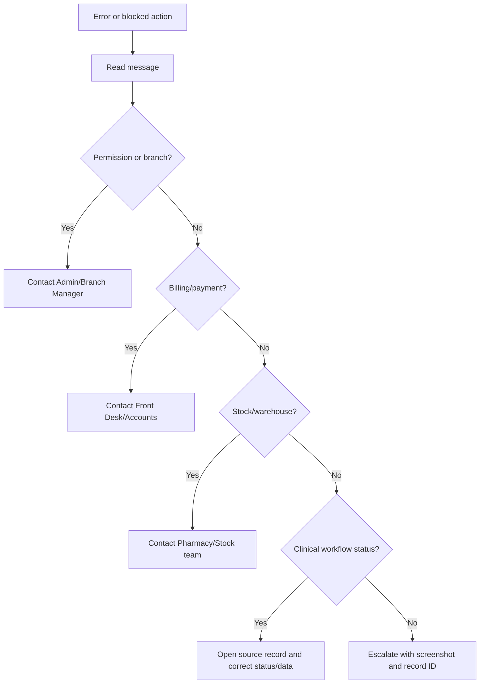

# Troubleshooting And Common Errors

## Purpose

Use this guide when something blocks normal doctor work.

## Who should use this

Veterinary doctors and supervisors supporting doctors during daily operations.

## Before you start

- Read the exact message on screen.
- Confirm the patient, branch, record status, and your role.
- Do not bypass billing, stock, or permission checks.

## Summary process diagram

## Step-by-step guide

1. Read the exact error or blocking message.
2. Note the record type and record ID.
3. Confirm whether the issue is permission, branch access, billing, stock, workflow status, or feature settings.
4. Try only the safe action suggested by the message, such as saving the record or selecting a missing field.
5. Do not bypass accounting, stock, payment, or permission controls.
6. Contact the correct team using the table below.
7. Include a screenshot, page URL, record ID, and the action you attempted.

## Common issues

| Problem | Likely reason | What the doctor should do | Who to contact |
|---|---|---|---|
| Cannot see Veterinary workspace | Missing `VetEdge Doctor`/Desk access or workspace hidden by role | Confirm login and ask for role bundle check | Admin |
| Cannot open patient | Branch restriction, missing permission, or wrong patient ID | Confirm patient ID and branch | Admin/Branch Manager |
| Cannot start consultation | Appointment not checked in/confirmed, missing patient, missing branch, or permission issue | Ask Front Desk to check appointment status and patient registration | Front Desk/Admin |
| Consultation asks to save before lab order | Consultation has unsaved changes or is new | Save consultation, then create lab order | Doctor |
| Payment gate blocks completion | Full/partial payment gate requires invoice/payment action | Ask Front Desk/Accounts to resolve invoice/payment | Front Desk/Accounts |
| Billing / Payment button missing | Billing feature disabled, record is new, or permission/action unavailable | Save record and ask Admin to verify settings | Admin/Accounts |
| Lab order cannot be edited | Lab order is Reviewed or Cancelled | Do not edit; follow correction process | Lab/Admin |
| `Select at least one lab test` | Lab order dialog submitted without tests | Select at least one active test | Doctor |
| Invoice already submitted | ERPNext submitted invoice cannot be edited directly | Ask Accounts about correction/cancellation/replacement | Accounts |
| Cancelled invoice replacement needed | Linked invoice is cancelled | Use billing modal if available or ask Accounts to regenerate/sync | Accounts |
| Vaccination feature disabled | Veterinary Settings disabled vaccination | Do not create workaround records | Admin |
| Cannot administer vaccine | Payment enforcement, missing doctor/nurse role, branch restriction, or invalid status | Resolve payment/status/branch issue | Admin/Accounts |
| Stock shortage during hospitalisation | Item quantity unavailable | Do not post stock; ask stock team to replenish or correct item/warehouse | Pharmacy/Stock |
| Missing warehouse | Branch dispensary warehouse is not configured | Stop stock posting and report branch/record | Pharmacy/Admin |
| Cannot discharge patient | Pending stock, pending charges/invoice, unpaid/partly paid gate, or missing discharge details | Run Check Discharge Readiness and resolve listed items | Accounts/Stock/Admin |
| Notification count not clearing | Notification still has `Unread` status | Mark Read/Done/Dismissed as appropriate | Doctor/Admin |
| Report shows no data | Filters too narrow, branch restriction, or no matching records | Check date/status/branch filters | Admin if still blocked |
| Permission denied | Role or branch access does not allow action | Capture record ID and message | Admin/Branch Manager |
| Feature disabled in settings | Veterinary Settings flag is off | Do not work around it in another record | Admin |

## Important notes

- Always include the record ID when asking for help.
- For billing issues, include the Sales Invoice ID if visible.
- For stock issues, include the item, quantity, branch, warehouse, and hospitalisation ID.
- For permission issues, include your login email, branch, and action attempted.

## What happens next

The correct team should resolve the root cause:

- Admin resolves role, permission, settings, and branch assignment issues.
- Front Desk resolves appointment, owner contact, scheduling, and check-in issues.
- Accounts resolves invoice/payment issues.
- Lab resolves sample and result-entry issues.
- Pharmacy/Stock resolves warehouse, item, batch, and stock-posting issues.

## Related records

- Veterinary Settings
- Branch User Assignment
- Veterinary Patient
- Veterinary Appointment
- Veterinary Consultation
- Veterinary Lab Order
- Veterinary Vaccination Record
- Veterinary Hospitalisation
- Sales Invoice
- Payment Entry
- Stock Entry

## Screenshots / visual references

When escalating, capture:

- The full error message.
- The page URL.
- The record ID.
- The relevant section of the form or modal.

## Source files inspected

- `vetedge/services/permissions.py`
- `vetedge/services/lab.py`
- `vetedge/services/vaccination.py`
- `vetedge/services/hospitalisation.py`
- `vetedge/services/billing_modal.py`
- `vetedge/services/payment_service.py`
- `vetedge/veterinary/doctype/veterinary_settings/veterinary_settings.json`
