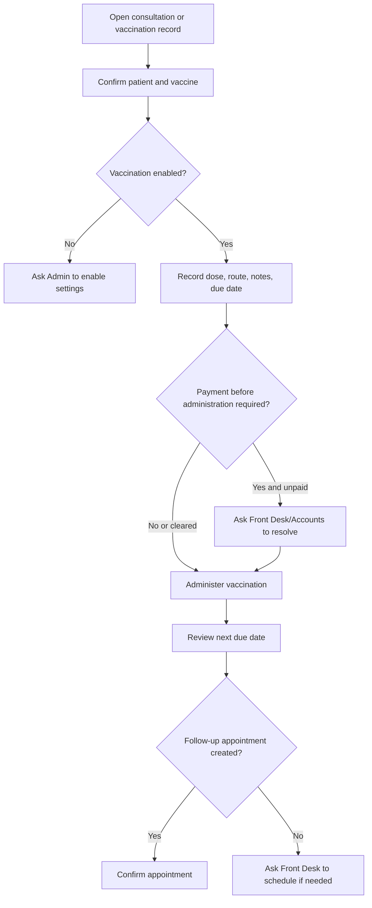

# Vaccination And Preventive Care Workflow

## Purpose

Use this guide to record vaccinations, review due or overdue vaccinations, and understand preventive care handoffs.

## Who should use this

Veterinary doctors responsible for vaccination decisions and clinical preventive care review.

## Before you start

- Confirm vaccination is enabled in Veterinary Settings.
- Confirm the patient, owner, vaccine, service branch, and species applicability.
- Check whether payment is required before administration.
- Confirm stock/batch details when stock posting is used.

## Summary process diagram

## Step-by-step guide

1. Open the consultation and click `New Vaccination`, or open `Vaccination Records`.
2. Confirm the patient and primary owner.
3. Select the vaccine.
4. Enter dose, route, administered date/time, notes, and next due date.
5. If the vaccine has default next due days, the system can populate the next due date.
6. If payment enforcement is active and the record is awaiting payment, do not administer until billing is resolved or an authorized override is applied.
7. Click `Administer Vaccination` when clinically and operationally ready.
8. Confirm linked invoice and stock entry references if generated.
9. Review due/overdue vaccinations from Vaccination Dashboard or Vaccination Report.
10. For due/overdue vaccines, confirm with Front Desk whether the owner should be contacted or an appointment should be scheduled.

## Vaccination status guide

| Status | Meaning |
|---|---|
| Draft | Vaccination record exists but is not ready/administered. |
| Awaiting Payment | Payment must be resolved if payment-before-administration is enforced. |
| Pending Administration | Record is ready for administration. |
| Administered | Vaccine has been administered. |
| Cancelled | Vaccination record is cancelled. |

## Doctor responsibility vs Front Desk responsibility

| Area | Doctor | Front Desk |
|---|---|---|
| Clinical decision to vaccinate | Owns | Supports scheduling |
| Vaccine choice and route | Owns | Does not decide clinically |
| Due/overdue interpretation | Owns clinical priority | Contacts owner and books appointment |
| Payment collection | Reviews status only unless enabled | Usually owns with Accounts |
| Follow-up appointment | Requests need | Schedules/confirms where appropriate |

## Important notes

- Vaccination can be created from consultation.
- Hospitalisation activities support vaccination activity logging when inpatient care is active.
- Vaccination records can link to invoice and stock entry.
- The system can classify due state as Due, Overdue, or Upcoming based on next due date.
- Doctors and nurses can administer vaccines; Front Desk may create drafts.

## Common mistakes

| Mistake | Better approach |
|---|---|
| Administering despite payment block | Resolve payment or authorized override first. |
| Missing next due date | Confirm default or manually enter due date. |
| Wrong species vaccine | Check vaccine applicability. |
| Missing batch when stock requires it | Confirm batch/expiry with pharmacy or stock team. |

## What happens next

- Due/overdue reminders may generate notifications.
- Follow-up vaccination appointment may be created depending on workflow.
- Billing and stock references remain linked for audit.

## Related records

- Veterinary Vaccination Record
- Veterinary Vaccine
- Veterinary Consultation
- Veterinary Appointment
- Sales Invoice
- Stock Entry

## Troubleshooting

See `troubleshooting_and_common_errors.md` for feature disabled, payment gate, stock shortage, and permission messages.

## Screenshots / visual references

Pending screenshots:

- `vaccination-entry.png`
- `vaccination-dashboard.png`

## Source files inspected

- `vetedge/services/vaccination.py`
- `vetedge/services/vaccination_notifications.py`
- `vetedge/veterinary/doctype/veterinary_vaccination_record/veterinary_vaccination_record.json`
- `vetedge/veterinary/doctype/veterinary_vaccination_record/veterinary_vaccination_record.js`
- `vetedge/veterinary/page/vetedge_vaccination_dashboard/vetedge_vaccination_dashboard.json`
