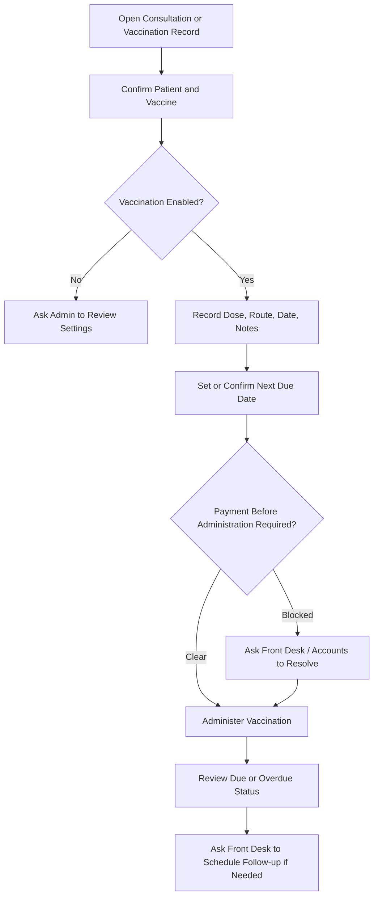

# Vaccination and Preventive Care Training Guide

## Module Purpose

Train veterinary doctors to record vaccination decisions, review preventive care status, handle due or overdue vaccinations, and hand off scheduling or payment work correctly.

## Learning Objectives

After this module, the doctor should be able to:

- Confirm patient, owner, vaccine, Branch, and species suitability.
- Record vaccination dose, route, notes, and next due date.
- Understand payment-before-administration messages.
- Review due, overdue, and upcoming preventive care.
- Hand off owner contact and scheduling to Front Desk.
- Hand off payment issues to Accounts or Cashier.

## Summary Process Diagram

## Step-by-Step Training Guide

1. Open the consultation and click New Vaccination, or open Vaccination Records.
2. Confirm patient, primary owner, vaccine, service Branch, and species suitability.
3. Enter dose, route, administered date/time, notes, and next due date.
4. If the vaccine has default next-due timing, confirm the populated date is clinically correct.
5. If payment enforcement is active and the record is awaiting payment, do not administer until payment is resolved or an authorised workflow allows progress.
6. Click Administer Vaccination when clinically and operationally ready.
7. Confirm linked invoice and stock references if they are visible.
8. Review due, overdue, and upcoming vaccinations from the Vaccination Dashboard or Vaccination Report.
9. Ask Front Desk to contact the owner or schedule an appointment when preventive care follow-up is needed.

## Trainer Notes

> Trainer Note: Doctors make the clinical vaccination decision. Front Desk coordinates scheduling and owner communication. Accounts handles payment blocks.

> Trainer Note: Use the words "due", "overdue", and "upcoming" carefully so doctors understand the difference between a clinical priority and a scheduling task.

## Practice Exercise

Scenario: A puppy is due for a booster vaccination.

Task:

1. Open the patient record.
2. Review vaccination history.
3. Create or open the vaccination record.
4. Confirm vaccine, dose, route, and next due date.
5. Explain what happens if payment is required before administration.
6. Explain what Front Desk should do after the next due date is set.

Expected outcome: The doctor records preventive care correctly and uses the right handoff for payment and scheduling.

## Vaccination Status Guide

| Status | Practical meaning |
|---|---|
| Draft | Vaccination record exists but is not ready or administered. |
| Awaiting Payment | Payment must be resolved if payment-before-administration is enforced. |
| Pending Administration | Record is ready for administration. |
| Administered | Vaccine has been administered. |
| Cancelled | Vaccination record is cancelled. |

## Common Mistakes

| Mistake | Better approach |
|---|---|
| Administering despite payment block | Resolve payment or authorised workflow first. |
| Missing next due date | Confirm default or enter the due date manually. |
| Choosing a vaccine unsuitable for species | Check vaccine suitability before administration. |
| Missing stock or batch detail when required | Confirm with Pharmacy, Dispensary, or stock team. |

## Troubleshooting

| Problem | What the doctor should do |
|---|---|
| Vaccination feature is disabled | Ask Admin to review Veterinary Settings. |
| Cannot administer vaccination | Check payment, status, role, and Branch access; involve Admin or Accounts. |
| Due list seems wrong | Check filters, patient, vaccine, and next due date. |
| Stock or batch issue appears | Ask Pharmacy, Dispensary, or stock team to review. |

## Related Roles and Handoffs

| Handoff | Responsible role |
|---|---|
| Clinical decision to vaccinate | Doctor |
| Owner contact and appointment booking | Front Desk |
| Payment collection or invoice issue | Accounts or Cashier |
| Stock, batch, and expiry support | Pharmacy, Dispensary, or stock team |
| Administration support where allowed | Nurse |

## Related Screenshots

- `training_assets/screenshots/vaccination-entry.png`
- `training_assets/screenshots/vaccination-dashboard.png`

See [Screenshot Manifest](screenshot_manifest.md) for capture instructions.

## Related Guides

- [Veterinary Doctor Training Manual](veterinary_doctor_training_manual.md)
- [Consultation Workflow](consultation_workflow.md)
- [Reports and Dashboards Workflow](reports_and_dashboards_workflow.md)
