# VetEdge Veterinary Doctor Training Manual

## Title Page

**Document:** Veterinary Doctor Training Manual  
**Audience:** Veterinary doctors and clinical trainers  
**Use:** Onboarding, refresher training, client handover, Training Centre display, and future PDF export  
**Scope:** Doctor-facing clinical workflows only  

## Training Purpose

This manual trains veterinary doctors to use VetEdge safely during daily clinic work. It focuses on practical tasks: finding patients, reviewing history, selecting approved Veterinary master values, recording consultations, requesting lab tests, handling vaccination and preventive care, managing Hospitalisation, responding to notifications, reviewing reports, understanding billing or payment messages, and handling grooming or boarding medical-safety handoffs.

Doctors remain responsible for clinical decisions and treatment instructions. VetEdge helps record those decisions, coordinate handoffs, and protect clinic workflows.

## Intended Users

- Veterinary doctors using the `VetEdge Doctor` role.
- Doctors assigned through the `Veterinary Doctor` role bundle.
- Clinical trainers onboarding new doctors.
- Supervisors reviewing doctor readiness before independent system use.

## Required Roles and Access

Doctors usually need:

- `VetEdge Doctor`
- Desk access
- Correct Branch assignment, where branch controls are enabled
- Access to Veterinary workspace, patient records, consultations, lab orders, vaccination records, hospitalisation records, notifications, and doctor reports
- Grooming and boarding access only where the live site grants additional service roles; otherwise these are handoff workflows for doctors

Some sites may use the `Veterinary Doctor` starter bundle. Live access must be verified in Role Permission Manager if it differs from this manual.

See [Role Access Matrix](training-module:role-access) for the trainer-friendly access guide.

## Learning Objectives

By the end of training, the doctor should be able to:

- Open the Veterinary workspace and review the daily queue.
- Search for an existing Veterinary Patient without creating duplicates.
- Review medical history before making care decisions.
- Select approved Veterinary master values and avoid duplicate masters.
- Start or continue a consultation.
- Record complaint, history, examination, assessment, diagnosis, treatment plan, planned treatments, and follow-up.
- Request lab orders and review completed results.
- Record vaccination and preventive care decisions.
- Admit and manage hospitalised patients.
- Handle grooming and boarding medical concerns as handoffs, not core clinical records.
- Understand payment gate and invoice status messages.
- Hand off work clearly to Front Desk, Accounts, Lab, Pharmacy, Dispensary, and Nurses.
- Use notifications, reports, and dashboards for day-to-day follow-up.
- Escalate common errors without bypassing safety controls.

## Training Assumptions

- Training uses a safe training site or approved demo records.
- Trainees do not create duplicate patient records.
- Trainees do not submit, cancel, amend, or manually alter invoices during doctor training.
- Submitted invoices remain protected for accounting accuracy.
- Payment collection and invoice correction are handled by Front Desk, Accounts, or Cashier unless the clinic explicitly grants another workflow.
- Screenshot placeholders may remain pending until a safe authenticated browser session and demo data are available.

## Recommended Training Schedule

| Session | Topic | Suggested duration |
|---|---:|---:|
| 1 | System overview, roles, daily workflow, and patient record review | 60-90 minutes |
| 2 | Consultation workflow, vitals, treatment plan, payment gate messages, and handoffs | 90-120 minutes |
| 3 | Lab orders, vaccination, preventive care, and notifications | 60-90 minutes |
| 4 | Hospitalisation workflow, discharge readiness, reports, troubleshooting, and assessment | 90-120 minutes |

## System Overview for Doctors

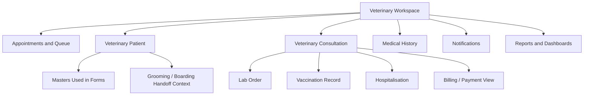

The Veterinary workspace is the doctor's main entry point. Doctors should use it to open appointments, patients, consultations, history, lab orders, vaccination records, Hospitalisation records, notifications, reports, and dashboards. Grooming and boarding are non-clinical service workflows; doctors usually interact with them only when medical review or escalation is needed.

## Doctor's Daily Workflow

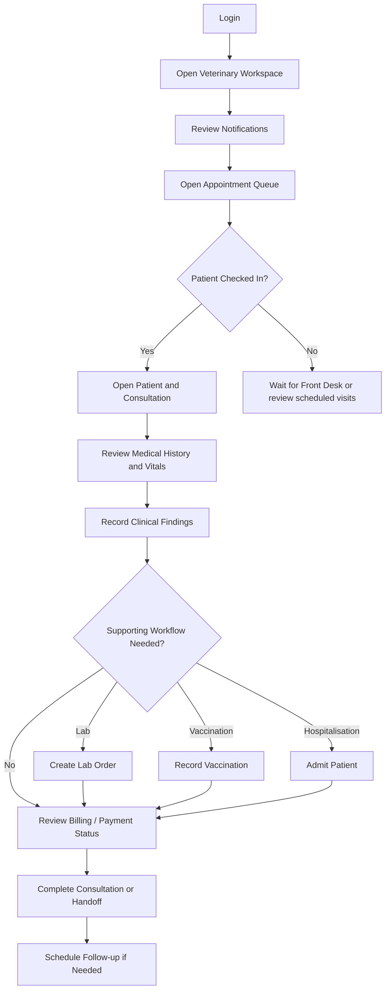

### Step-by-Step Training Guide

1. Login and open the Veterinary workspace.
2. Review Veterinary notifications before starting consultations.
3. Open the Appointment Queue or appointment list.
4. Confirm the patient has been checked in by Front Desk where required.
5. Open the existing patient record and linked consultation.
6. Review history, latest vitals, lab results, vaccinations, and hospitalisation history.
7. Record the current clinical findings and treatment plan.
8. Create lab, vaccination, or hospitalisation records only when clinically required.
9. Review billing or payment messages without changing submitted invoices.
10. Complete the consultation, request follow-up, or hand off to the correct team.
11. If a grooming or boarding health concern appears, review the patient clinically and hand off service workflow steps to the appropriate team.

> Trainer Note: Pause here and explain that the doctor should not create duplicate patient records. If the patient already exists, open the existing patient record and continue from there.

### Practice Exercise

Scenario: A dog is brought in for vomiting and weakness.

Task:

1. Open the patient record.
2. Review previous consultation history.
3. Start or open the current consultation.
4. Record the complaint and assessment.
5. Add diagnosis and treatment plan notes.
6. Decide whether a lab order is required.
7. Add a follow-up plan.

Expected outcome: The doctor completes the clinical consultation workflow without creating duplicate records or bypassing payment messages.

> Screenshot pending: Capture this from the Clinical Dashboard or Veterinary workspace for a doctor login.

## Patient Record Training

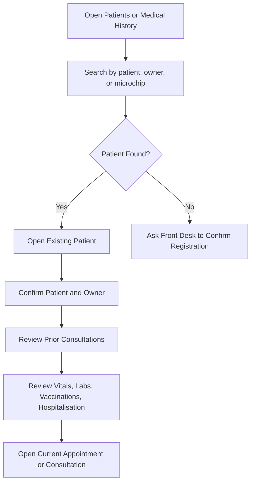

### Step-by-Step Training Guide

1. Search before creating a patient.
2. Confirm patient name, species, breed, sex, age, microchip, and default branch.
3. Confirm the primary owner before discussing care.
4. Review previous consultations, vitals, lab orders, vaccination records, and hospitalisation records.
5. Open the active appointment or consultation when ready to continue care.

> Trainer Note: Explain that patient history is patient-centric. A patient may receive care at more than one branch, but branch access can still limit what a doctor can open.

### Practice Exercise

Scenario: Two patients have similar names.

Task:

1. Search for the patient.
2. Compare owner, species, breed, and microchip.
3. Open the correct patient.
4. Review the medical history timeline.

Expected outcome: The doctor identifies the correct patient and avoids duplicate or wrong-patient documentation.

## Veterinary Masters Awareness

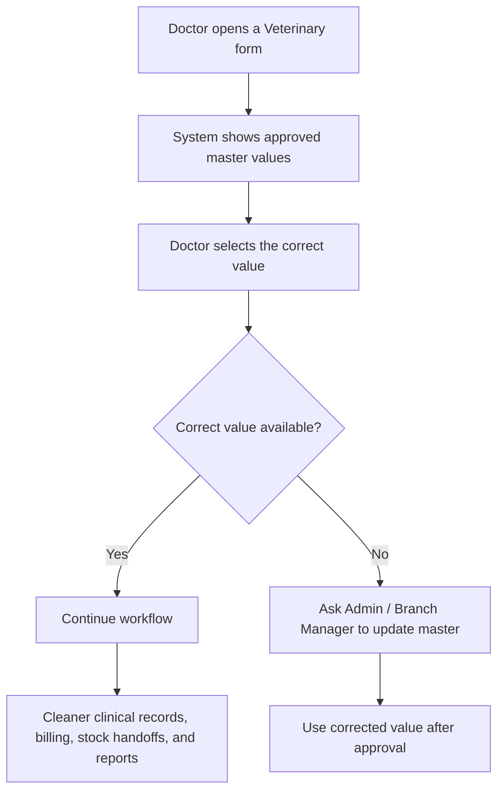

Doctors will see approved master values in forms, such as Consultation Type, Veterinary Lab Test, Veterinary Vaccine, Veterinary Treatment Item, Veterinary Symptom, Veterinary Diagnosis, Species, Breed, Branch, Item, and care-location or service values where access allows.

Use the correct approved value. Do not create duplicate masters just because the wording is slightly different. If a value is missing, ask Admin or Branch Manager to review it.

> Trainer Note: Explain that a master value affects more than a dropdown. Wrong or duplicate values can make reports, billing, stock handoffs, and patient history harder to trust.

### Practice Exercise

Scenario: The doctor cannot find the correct Consultation Type for a skin recheck.

Task:

1. Search the available Consultation Type values.
2. Decide whether an existing value is appropriate.
3. If not, prepare a request for Admin or Branch Manager.
4. Explain why duplicate master values should be avoided.

Expected outcome: The doctor uses approved master values and escalates missing values instead of creating duplicates.

Detailed guide: [Veterinary Masters Awareness Reference](training-module:veterinary-masters)

## Consultation Training

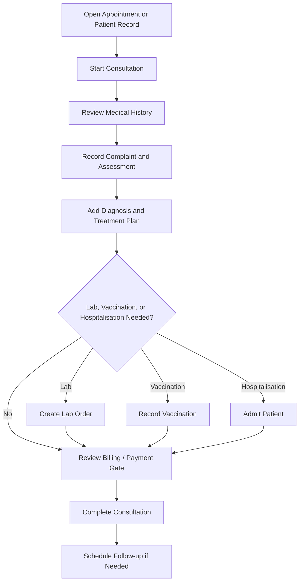

### Step-by-Step Training Guide

1. Open the consultation from the appointment, queue, patient record, or consultation list.
2. Confirm patient, owner, service branch, practitioner, and linked appointment.
3. Select the consultation type where required.
4. Record complaint, history, examination notes, assessment, diagnosis, planned treatment, treatment plan, and follow-up date.
5. Add fresh vitals as Veterinary Vital Signs, not only in notes.
6. Create lab, vaccination, or hospitalisation records from the consultation when needed.
7. Open Billing / Payment to understand invoice or payment status.
8. If a payment gate blocks the workflow, ask Front Desk or Accounts to resolve it.
9. Complete the consultation only when clinical notes and next steps are clear.

> Trainer Note: Explain that doctors may see billing status, but submitted invoices are protected. Doctors should not manually alter submitted invoices or mark invoices paid.

### Practice Exercise

Scenario: A cat presents for poor appetite and weight loss.

Task:

1. Open the consultation.
2. Review medical history and latest vitals.
3. Record assessment and diagnosis.
4. Add a treatment plan.
5. Request lab testing if clinically required.
6. Review the billing/payment message.

Expected outcome: The doctor records a complete consultation and uses the correct handoff if payment or lab work is required.

## Lab Order Training

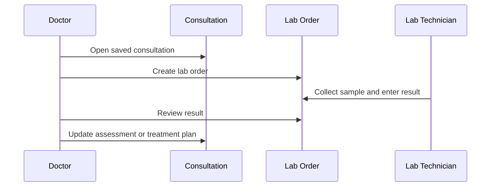

### Step-by-Step Training Guide

1. Save the consultation before creating the lab order.
2. Click New Lab Order.
3. Select clinically necessary tests.
4. Add sample notes where helpful.
5. Submit the lab order request.
6. Lab staff collect samples, process tests, and enter results.
7. Review results when they are entered.
8. Update the consultation assessment, diagnosis, treatment plan, follow-up, or hospitalisation plan if needed.

> Trainer Note: Doctors request and review lab orders. Lab Technicians usually process samples and enter results. Reviewed lab results should not be casually edited.

### Practice Exercise

Scenario: A patient with vomiting needs diagnostic blood work.

Task:

1. Open a saved consultation.
2. Create a lab order with appropriate tests.
3. Open the lab order summary.
4. Explain what the doctor does after results are entered.

Expected outcome: The doctor can request lab work and describe the review handoff without editing lab results incorrectly.

## Vaccination and Preventive Care Training

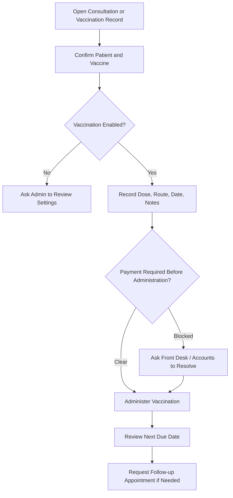

### Step-by-Step Training Guide

1. Open the consultation and create a vaccination record, or open an existing vaccination record.
2. Confirm patient, owner, vaccine, service branch, and species suitability.
3. Enter dose, route, administered date/time, notes, and next due date.
4. Check any payment-before-administration message.
5. Administer only when the vaccination is clinically and operationally ready.
6. Review due, overdue, and upcoming vaccinations through dashboard or report views.
7. Ask Front Desk to contact the owner or schedule follow-up where needed.

> Trainer Note: Doctors own the clinical decision to vaccinate. Front Desk supports appointment coordination and owner communication. Accounts handles payment resolution.

### Practice Exercise

Scenario: A puppy is due for a booster.

Task:

1. Open the patient record.
2. Review vaccination history.
3. Create or open the vaccination record.
4. Enter dose, route, and next due date.
5. Explain what happens if payment is required first.

Expected outcome: The doctor records preventive care correctly and understands when to hand off to Front Desk or Accounts.

## Hospitalisation Training

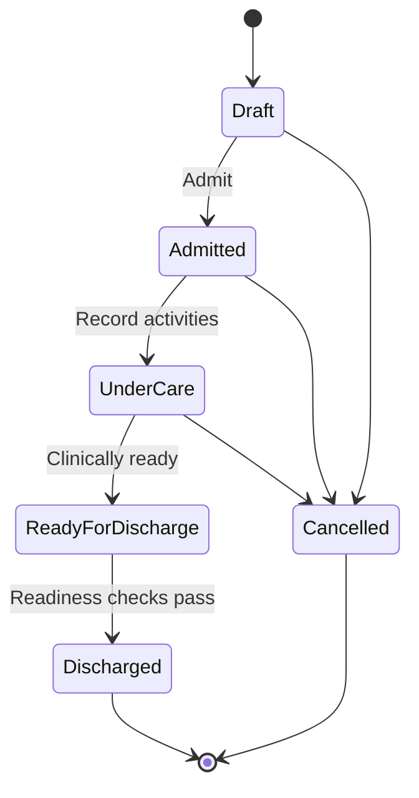

### Step-by-Step Training Guide

1. From a consultation, click Admit for Hospitalisation, or open an existing hospitalisation record.
2. Confirm patient, owner, service branch, company, consultation, attending veterinarian, admission reason, and care level.
3. Assign a care location where location tracking is used.
4. Admit the patient.
5. Record ongoing activities such as vitals, medication, fluid therapy, feeding, nursing notes, lab, procedures, owner updates, and other activities.
6. Mark billable or stock-affecting activities correctly.
7. Build the charge sheet and generate daily charges where required.
8. Sync charges to Sales Invoice through the proper workflow.
9. Post stock usage only through the supported stock process.
10. Check payment gate and discharge readiness before discharge.
11. Record discharge summary, condition at discharge, instructions, and follow-up notes.

> Trainer Note: Hospitalisation has more handoffs than most workflows. Doctors own clinical care and discharge decisions. Nurses may record care activities, Pharmacy or Dispensary handles stock, and Accounts handles invoice or payment issues.

### Practice Exercise

Scenario: A dehydrated patient needs inpatient monitoring and fluids.

Task:

1. Admit the patient for Hospitalisation.
2. Assign care location if used.
3. Add a vitals activity and fluid therapy activity.
4. Mark which activities should be billable or stock-affecting.
5. Run the discharge readiness explanation.

Expected outcome: The doctor can admit, record inpatient care, and explain discharge blocks without bypassing billing or stock checks.

## Grooming Service Handoff

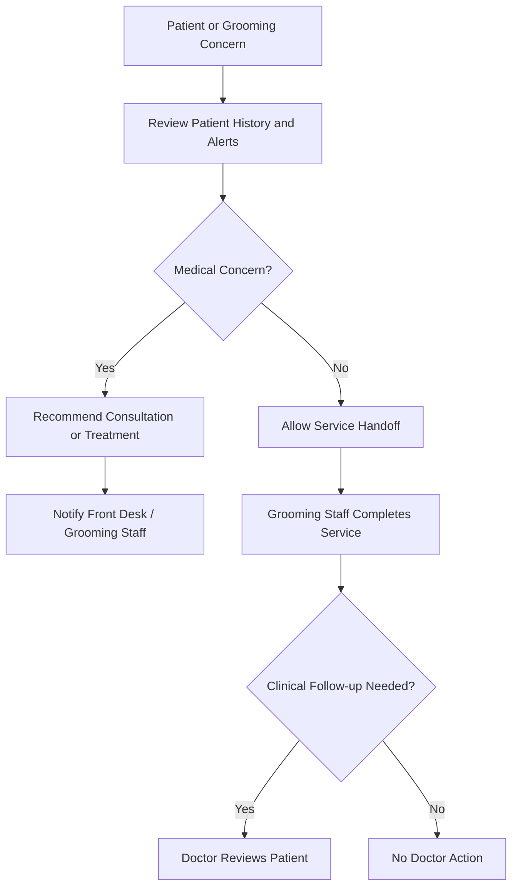

Grooming is a non-clinical service workflow. In the verified role maps, `VetEdge Doctor` is not listed for Pet Grooming Appointment, Pet Grooming Session, Pet Grooming Service, Grooming Dashboard, or Grooming Report. Doctors should therefore treat grooming as a medical-safety handoff unless the live site grants additional access.

Doctor responsibility is to review medical concerns when asked: wounds, skin infection, parasites, pain, anxiety, handling risk, recent surgery, or vaccination/preventive care issues. Front Desk and Grooming Staff handle grooming scheduling, service completion, and grooming notes. Accounts handles grooming payment issues.

> Trainer Note: A grooming concern becomes a consultation only when clinical assessment or treatment is needed. Do not document routine grooming as a consultation.

### Practice Exercise

Scenario: Grooming staff report a wound before starting the service.

Task:

1. Open the patient record.
2. Review recent history and alerts.
3. Decide whether grooming should proceed.
4. Recommend consultation if needed.
5. Explain the handoff to Front Desk and Grooming Staff.

Expected outcome: The doctor protects patient safety without taking over the grooming workflow.

Detailed guide: [Grooming Service Handoff Workflow](training-module:grooming-handoff)

## Boarding Service Handoff

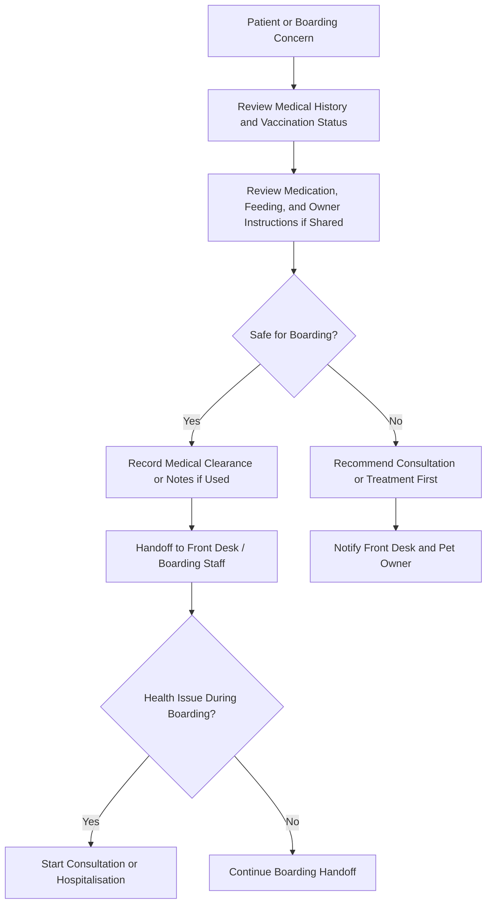

Boarding is a non-clinical service workflow. It is different from Hospitalisation. Boarding covers accommodation and routine care; Hospitalisation covers inpatient clinical treatment and monitoring.

In the verified role maps, `VetEdge Doctor` is not listed for Pet Boarding Booking, Pet Boarding Stay, Pet Boarding Care Record, Kennel, Boarding Dashboard, Boarding Report, or Kennel Availability Report. Doctors should treat boarding as a medical-safety handoff unless the live site grants additional access.

Doctor responsibility is to advise on medical clearance, vaccination/preventive care concerns, medication or feeding concerns, and any health issue that arises during boarding. Front Desk and boarding staff handle booking, kennel assignment, check-in/check-out, routine care records, and Pet Owner coordination. Accounts handles boarding payment issues.

> Trainer Note: If a boarding patient needs clinical monitoring, fluids, oxygen, repeated medication, or urgent treatment, the workflow should move to consultation or Hospitalisation as clinically appropriate.

### Practice Exercise

Scenario: A boarding patient has overdue vaccination and a history of seizures.

Task:

1. Open the patient record.
2. Review vaccination and consultation history.
3. Decide whether boarding can proceed safely.
4. Write or communicate the medical recommendation.
5. Explain the handoff to Front Desk, boarding staff, and the Pet Owner.

Expected outcome: The doctor recognises medical risk and escalates clinical care correctly.

Detailed guide: [Boarding Service Handoff Workflow](training-module:boarding-handoff)

## Notifications and Action Centre Training

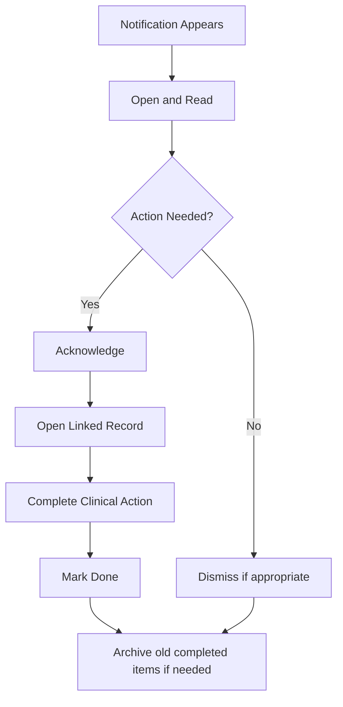

### Step-by-Step Training Guide

1. Check Veterinary notifications at the start of the day and between consultations.
2. Open unread notifications first.
3. Review priority, message, reference record, and action link.
4. Acknowledge items you are acting on.
5. Open the linked patient, consultation, lab order, vaccination, appointment, or hospitalisation record.
6. Mark Done only after completing the required action.
7. Dismiss only when no action is needed.

> Trainer Note: Marking Done is a clinical communication signal. Doctors should not clear notifications just to reduce the count.

### Practice Exercise

Scenario: A lab result notification appears.

Task:

1. Open the notification.
2. Open the linked lab order.
3. Review the result.
4. Explain what should be updated in the consultation.
5. Mark the notification Done only after the action is complete.

Expected outcome: The doctor treats notifications as clinical handoffs, not just messages.

## Reports and Dashboards Training

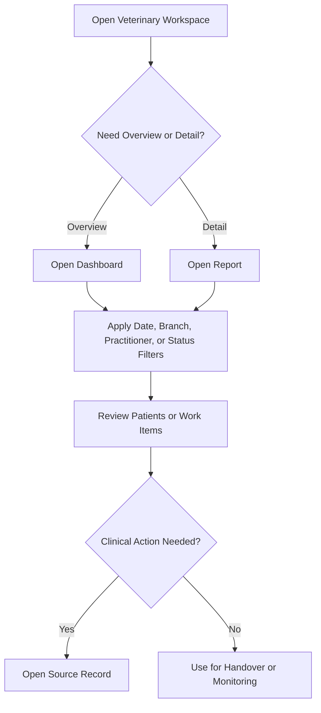

### Step-by-Step Training Guide

1. Open the Veterinary workspace.
2. Use dashboards for live overviews.
3. Use reports for filtered lists.
4. Apply filters carefully, especially Branch, date, practitioner, and status.
5. Open the source record before taking action.
6. Treat financial information as context and involve Accounts for payment or invoice work.

> Trainer Note: A report is not a shortcut around permissions. If a doctor cannot open the source record, access should be verified rather than bypassed.

### Practice Exercise

Scenario: The doctor wants to find all lab results waiting for review.

Task:

1. Open the Lab Dashboard or Lab Order Report.
2. Filter for result-entered or pending-review items where available.
3. Open one source lab order.
4. Describe the correct next clinical action.

Expected outcome: The doctor uses reports and dashboards to return to the proper clinical record.

## Troubleshooting Guide

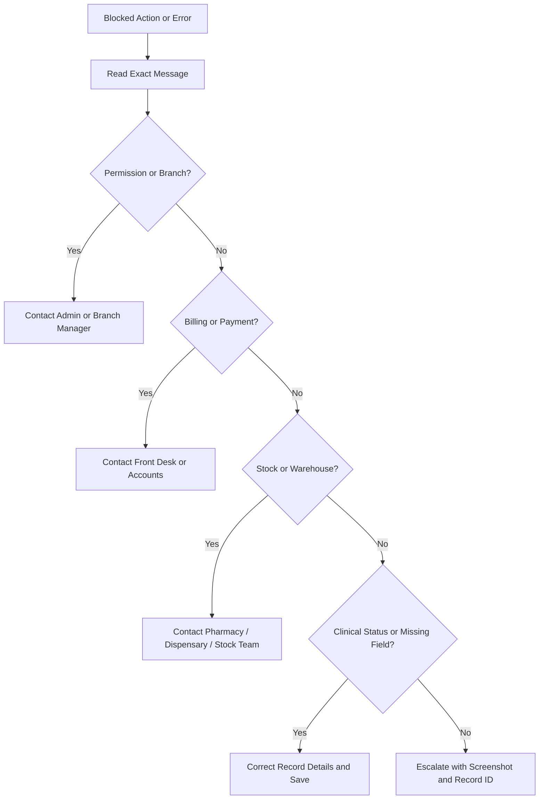

### Practical Troubleshooting Rules

- Read the exact message before acting.
- Note the record type and record ID.
- Save the record if the message says unsaved changes are blocking the action.
- Ask Front Desk or Accounts to resolve payment gates.
- Ask Pharmacy, Dispensary, or stock team to resolve stock or warehouse messages.
- Ask Admin or Branch Manager to verify role or branch access.
- Do not bypass accounting, stock, branch, payment, or permission controls.

See [Troubleshooting and Common Errors](training-module:troubleshooting) for the full trainer reference.

## Handoff Guide

| Area | Doctor responsibility | Handoff role |
|---|---|---|
| Registration and appointment coordination | Confirm the correct patient and clinical context | Front Desk |
| Payment or invoice block | Read the message and pause the blocked workflow | Front Desk, Accounts, or Cashier |
| Submitted invoice correction | Do not manually alter the invoice | Accounts |
| Lab processing | Request tests and review results | Lab Technician |
| Medication dispensing | Prescribe and document treatment instruction | Pharmacy or Dispensary |
| Vitals and inpatient care tasks | Give clinical instructions and review findings | Nurse |
| Hospitalisation billing or stock readiness | Review readiness and resolve clinical notes | Accounts, Pharmacy, Dispensary, or stock team |
| Grooming medical concern | Review patient safety and recommend consultation if needed | Front Desk and Grooming Staff |
| Boarding medical concern | Review fitness, vaccination/medication concerns, and escalate to consultation or Hospitalisation if needed | Front Desk and boarding staff |

## Doctor Training Checklist

By the end of this training, the doctor should be able to:

- [ ] Open and review a patient record.
- [ ] Start or continue a consultation.
- [ ] Record clinical assessment.
- [ ] Add diagnosis and treatment plan.
- [ ] Request lab orders where required.
- [ ] Review lab results and update the care plan.
- [ ] Record or review vaccination details.
- [ ] Admit a patient for Hospitalisation where required.
- [ ] Record hospitalisation activities.
- [ ] Select approved Veterinary master values and avoid duplicate masters.
- [ ] Explain grooming as a non-clinical service handoff.
- [ ] Explain boarding as a non-clinical service handoff and distinguish it from Hospitalisation.
- [ ] Understand payment gate messages.
- [ ] Avoid manually altering submitted invoices.
- [ ] Use notifications correctly.
- [ ] Open doctor-accessible reports and dashboards.
- [ ] Hand off billing, lab, stock, and appointment tasks to the correct role.

## Post-Training Assessment Checklist

The trainer should confirm the doctor can:

- [ ] Explain the difference between patient, owner, appointment, consultation, and medical history.
- [ ] Search safely before creating or requesting any new patient record.
- [ ] Complete a consultation from queue to follow-up.
- [ ] Create a lab order from a saved consultation.
- [ ] Explain what happens when lab results are entered.
- [ ] Record a vaccination and next due date.
- [ ] Explain payment-before-administration handling.
- [ ] Admit and manage a hospitalised patient.
- [ ] Explain discharge readiness blocks.
- [ ] Explain when grooming or boarding concerns should become a consultation.
- [ ] Explain when a boarding concern should become Hospitalisation.
- [ ] Use notifications without clearing unfinished work.
- [ ] Use dashboards and reports to find source records.
- [ ] Escalate permission, branch, billing, and stock issues correctly.

## Trainer Notes

- Use one realistic patient scenario throughout training so the workflow feels like a clinic day.
- Ask the trainee to read every payment or warning message aloud before acting.
- Reinforce that doctors make clinical decisions, while Accounts protects accounting accuracy.
- Reinforce that Veterinary Vital Signs are separate records and should not be hidden inside notes only.
- Remind trainees that Front Desk handles registration, owner contact, and appointment coordination.
- Remind trainees that Lab, Pharmacy, Dispensary, Nurses, and Accounts each have their own handoff points.

## Screenshot Placeholders

Screenshots are listed and tracked in [Screenshot Manifest](training-module:screenshot-manifest). Current placeholders include:

- `training_assets/screenshots/doctor-dashboard-overview.png`
- `training_assets/screenshots/appointment-queue-overview.png`
- `training_assets/screenshots/patient-record-opened.png`
- `training_assets/screenshots/medical-history-timeline.png`
- `training_assets/screenshots/consultation-assessment-section.png`
- `training_assets/screenshots/consultation-treatment-plan.png`
- `training_assets/screenshots/billing-payment-modal.png`
- `training_assets/screenshots/lab-order-dialog.png`
- `training_assets/screenshots/vaccination-entry.png`
- `training_assets/screenshots/hospitalisation-activity-log.png`
- `training_assets/screenshots/veterinary-notification-badge.png`
- `training_assets/screenshots/doctor-reports-list.png`
- `training_assets/screenshots/veterinary-master-selection-example.png`
- `training_assets/screenshots/grooming-service-record.png`
- `training_assets/screenshots/grooming-health-note-handoff.png`
- `training_assets/screenshots/boarding-service-record.png`
- `training_assets/screenshots/boarding-health-vaccination-review.png`
- `training_assets/screenshots/boarding-medical-alert-owner-instruction.png`

## Appendix: Detailed Module Guides

- [Role Access Matrix](training-module:role-access)
- [Doctor Daily Workflow](training-module:daily-workflow)
- [Patient Medical Record Workflow](training-module:patient-record)
- [Veterinary Masters Awareness Reference](training-module:veterinary-masters)
- [Consultation Workflow](training-module:consultation)
- [Lab Order Workflow](training-module:lab-order)
- [Vaccination and Preventive Care Workflow](training-module:vaccination)
- [Hospitalisation Workflow](training-module:hospitalisation)
- [Grooming Service Handoff Workflow](training-module:grooming-handoff)
- [Boarding Service Handoff Workflow](training-module:boarding-handoff)
- [Notifications and Action Centre Workflow](training-module:notifications)
- [Reports and Dashboards Workflow](training-module:reports-dashboards)
- [Troubleshooting and Common Errors](training-module:troubleshooting)
- [Glossary](training-module:glossary)
- [Screenshot Manifest](training-module:screenshot-manifest)
