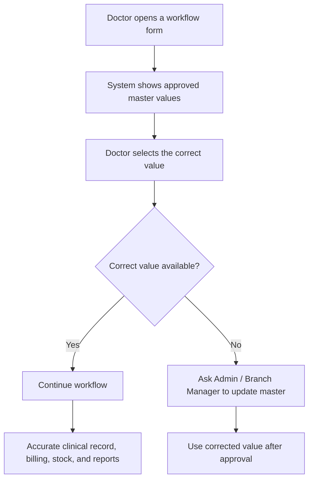

# Veterinary Masters Awareness Reference

## Module Purpose

Train veterinary doctors to understand master records they may see in workflow forms, without turning this into admin setup training.

## Learning Objectives

After this module, the doctor should be able to:

- Explain what a master record is.
- Select the correct master value in clinical forms.
- Avoid creating duplicate master records.
- Know when to ask Admin or Branch Manager to update a master.
- Understand how wrong master values affect reporting, billing, stock, and workflow quality.

## Summary Process Diagram

## Step-by-Step Reference Guide

1. Treat master records as approved clinic vocabulary and setup values.
2. Search carefully before selecting or creating a value.
3. Select the most accurate value available.
4. Do not create near-duplicates such as `General Consult`, `General Consultation`, and `General Vet Consult`.
5. If the correct value is missing, pause and ask Admin or Branch Manager to update the master.
6. If the wrong value was selected on a saved record, correct it only if your role and clinic policy allow it.
7. If the wrong value affects billing, stock, or a submitted invoice, ask Accounts, Pharmacy/Dispensary, or Admin to review before changing downstream records.

## Trainer Notes

> Trainer Note: Explain that masters keep clinic data consistent. They are not just dropdown options; they drive cleaner reports, billing links, stock handoffs, and workflow routing.

> Trainer Note: Doctors may have create/write access to several clinical masters in the discovered configuration, but training should still discourage casual creation. The clinic should decide who maintains master lists.

## Practical Exercise

Scenario: A doctor cannot find the exact consultation type needed for a follow-up skin review.

Task:

1. Search available Consultation Type values.
2. Decide whether an existing value is appropriate.
3. If not, write a short request for Admin or Branch Manager.
4. Explain what could happen if the doctor creates a duplicate value.

Expected outcome: The doctor uses approved values and escalates missing values instead of creating duplicates.

## Verified Master Records Doctors May Encounter

| Master record | Doctor-facing use | Verified doctor access found | Training note |
|---|---|---|---|
| Consultation Type | Categorises consultations. | `VetEdge Doctor` create/read/write row found. | Use the closest approved type; ask Admin before adding duplicates. |
| Veterinary Service Type | Classifies service activity. | `VetEdge Doctor` create/read/write row found. | Wrong selection can affect reports and workflow grouping. |
| Veterinary Treatment Type | Groups treatment types. | `VetEdge Doctor` create/read/write row found. | Keep naming consistent for reporting. |
| Veterinary Treatment Item | Structured treatment item used in treatment planning. | `VetEdge Doctor` create/read/write row found. | Wrong item may affect dispensary and billing handoff quality. |
| Veterinary Lab Test | Lab test catalogue for lab orders. | `VetEdge Doctor` create/read/write row found. | Wrong test selection creates lab and billing confusion. |
| Veterinary Vaccine | Vaccine catalogue for vaccination records. | `VetEdge Doctor` create/read/write row found. | Confirm species suitability and next due timing where configured. |
| Veterinary Species | Patient species list. | `VetEdge Doctor` create/read/write row found. | Duplicate species makes patient reports unreliable. |
| Veterinary Breed | Patient breed list. | `VetEdge Doctor` create/read/write row found. | Confirm species/breed before documenting care. |
| Veterinary Symptom | Structured symptom list. | `VetEdge Doctor` create/read/write row found. | Use approved symptom labels where available. |
| Veterinary Diagnosis | Structured diagnosis list. | `VetEdge Doctor` create/read/write row found. | Helps clinical reporting and history review. |
| Veterinary Diagnosis Category | Diagnosis grouping. | `VetEdge Doctor` create/read/write row found. | Ask Admin before creating new categories. |
| Item | ERPNext item used for billing or stock. | Workspace exposes Item to doctor role; exact live actions depend on ERPNext permissions. | Do not create or alter stock/billing items casually. Needs verification from Role Permission Manager. |
| Branch | Operational clinic location. | Setup link is not doctor-focused in workspace. | Ask Admin or Branch Manager for Branch corrections. |
| Company | ERPNext company. | Not doctor-facing in this training pack. | Accounts/Admin owns company setup. |
| Warehouse | ERPNext stock location. | Not doctor-facing in this training pack. | Pharmacy/Dispensary/Admin owns warehouse setup. |
| Veterinary Care Location | Hospitalisation care location. | No `VetEdge Doctor` DocType permission row found, but workspace Hospitalisation section shows Care Locations to doctors. | Treat as read/selection awareness. Needs verification from Role Permission Manager. |
| Pet Grooming Service | Grooming service catalogue. | No `VetEdge Doctor` permission row found. | Non-clinical service master; Front Desk/Groomer/Manager/Admin own it. |
| Kennel | Boarding location. | No `VetEdge Doctor` permission row found. | Non-clinical boarding location master; Front Desk/Branch Manager/Admin own it. |

## Common Mistakes

| Mistake | Better approach |
|---|---|
| Creating a new value because spelling differs slightly | Search first and ask Admin to standardise if needed. |
| Selecting a billing item as a clinical treatment without checking meaning | Use approved treatment items and ask Pharmacy/Dispensary or Accounts if unsure. |
| Choosing the wrong lab test | Confirm the intended test before submitting the lab order. |
| Treating grooming or kennel masters as clinical records | Use them only as non-clinical service/location context. |

## Troubleshooting

| Problem | Likely reason | What the doctor should do |
|---|---|---|
| Master value is missing | Master list has not been configured | Ask Admin or Branch Manager to add or activate the value. |
| Duplicate values exist | Previous inconsistent setup | Ask Admin to review and merge/standardise according to clinic policy. |
| Wrong service or treatment item was selected | Similar names or unclear catalogue | Correct only where safe; ask Accounts/Dispensary if billing or stock is affected. |
| Care location, grooming service, or kennel cannot be opened | Doctor role may not have direct access | Treat as Needs verification from Role Permission Manager. |

## Related Roles and Handoffs

| Handoff | Responsible role |
|---|---|
| Master cleanup and naming policy | Admin or Branch Manager |
| Billing item or submitted invoice impact | Accounts |
| Stock item, batch, warehouse impact | Pharmacy, Dispensary, or stock team |
| Clinical meaning of diagnosis/treatment selection | Doctor |
| Grooming service or kennel setup | Front Desk, Groomer, Branch Manager, or Admin |

## Related Screenshots

- `training_assets/screenshots/veterinary-master-selection-example.png`

See [Screenshot Manifest](screenshot_manifest.md) for capture instructions.

## Related Guides

- [Veterinary Doctor Training Manual](veterinary_doctor_training_manual.md)
- [Consultation Workflow](consultation_workflow.md)
- [Lab Order Workflow](lab_order_workflow.md)
- [Vaccination and Preventive Care Workflow](vaccination_and_preventive_care_workflow.md)
- [Troubleshooting and Common Errors](troubleshooting_and_common_errors.md)
